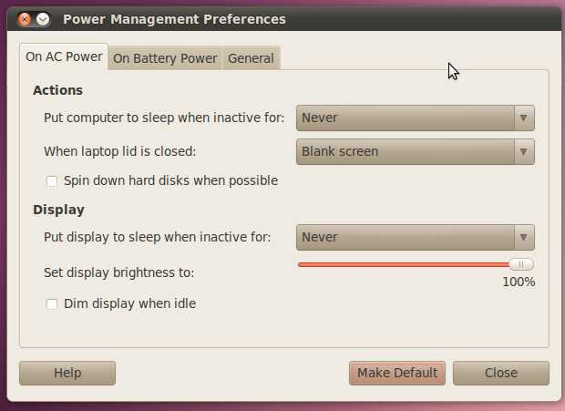

20100727
========

Nachdem :term:`rose` ca. eine Woche nicht benutzt worden war, fror sie wieder nach spätestens ein paar Minuten fest, und der Trick mit dem BIOS-Reset funktionierte nicht mehr. 

Etwa einen Monat lang schien das Problem komplett reproduzierbar: wenn man den Deckel schloss bevor sie runtergefahren war, dann gefror sie ab dem anschließenden Hochfahren jedesmal innerhalb kurzer Zeit, oft schon bevor der Desktop aufgebaut war, manchmal auch kurz danach. Und erst wenn ich dann im BIOS den Befehl "load factory defaults" gemacht hatte, funktionierte alles wieder normal. Und das, obwohl ich im BIOS keinerlei Anpassungen habe. Also offenbar macht das "load factory defaults" noch mehr als einfach nur alle manuellen Einstellungen zu stornieren.

Auf `ubuntuforums.org <http://ubuntuforums.org/showthread.php?t=1478787&highlight=laptop+freeze>`__
läuft zur Zeit ein langer Thread "Ubuntu 10.04 (Lucid Lynx) Random Freeze / Hang-up".

Daraufhin probierte ich auch auf Rose, die USB-Maus einzustecken. Und siehe da: der Fehler hörte auf!

Danach hatte ich mehrere Stunden lang keine Probleme, Ly konnte ihre Mails abrufen und ich ein `aptitude dist-upgrade` machen. Hier eine Bildschirmkopie::

  root@rose:~# aptitude dist-upgrade
  Reading package lists... Done
  Building dependency tree
  Reading state information... Done
  Reading extended state information
  Initializing package states... Done
  The following NEW packages will be installed:
    linux-headers-2.6.32-24{a} linux-headers-2.6.32-24-generic{a} linux-image-2.6.32-24-generic
  The following packages will be REMOVED:
    linux-headers-2.6.32-22{u} linux-headers-2.6.32-22-generic{u}
  The following packages will be upgraded:
    app-install-data-partner apt apt-transport-https apt-utils at-spi base-files binutils brasero brasero-common
    byobu dpkg empathy empathy-common evince evolution-data-server evolution-data-server-common f-spot firefox
    firefox-branding firefox-gnome-support flashplugin-installer gdm gedit gedit-common ghostscript ghostscript-cups
    ghostscript-x gnome-about gnome-desktop-data gnome-keyring gnome-orca gnome-panel gnome-panel-data grub-common
    grub-pc gtk2-engines-pixbuf gwibber gwibber-service humanity-icon-theme hunspell-en-ca language-selector
    language-selector-common libatk1.0-0 libatk1.0-data libatspi1.0-0 libbrasero-media0 libc-bin libc-dev-bin libc6
    libc6-dev libc6-i686 libcamel1.2-14 libebackend1.2-0 libebook1.2-9 libecal1.2-7 libedata-book1.2-2
    libedata-cal1.2-6 libedataserver1.2-11 libedataserverui1.2-8 libegroupwise1.2-13 libevdocument2 libevview2
    libexchange-storage1.2-3 libfreetype6 libgail-common libgail18 libgcr0 libgdata-google1.2-1 libgdata1.2-1
    libgnome-desktop-2-17 libgnome-keyring0 libgnomekbd-common libgnomekbd4 libgp11-0 libgs8 libgssapi-krb5-2
    libgstfarsight0.10-0 libgtk2.0-0 libgtk2.0-bin libgtk2.0-common libgtksourceview2.0-0 libgtksourceview2.0-common
    libk5crypto3 libkrb5-3 libkrb5support0 libnautilus-extension1 libnotify1 libpam-gnome-keyring libpam-modules
    libpam-runtime libpam0g libpanel-applet2-0 libparted0debian1 libpng12-0 libsoup-gnome2.4-1 libsoup2.4-1
    libusb-0.1-4 libvte-common libvte9 light-themes linux-firmware linux-generic linux-headers-generic
    linux-image-generic linux-libc-dev myspell-en-gb myspell-en-za nautilus nautilus-data nautilus-sendto-empathy
    openoffice.org-thesaurus-en-us parted python-farsight python-pyatspi python-ubuntuone-client python-vte rhythmbox
    rhythmbox-plugin-cdrecorder rhythmbox-plugins software-center sudo thunderbird transmission-common
    transmission-gtk ubuntuone-client ubuntuone-client-gnome ureadahead vinagre xserver-common xserver-xorg-core
    xulrunner-1.9.2
  131 packages upgraded, 3 newly installed, 2 to remove and 0 not upgraded.
  Need to get 77.3MB/145MB of archives. After unpacking 106MB will be used.
  Do you want to continue? [Y/n/?]

Power Management ?
------------------

Dann tat es mir leid, dass die arme Rose oft stundenlang unbenutzt da
steht und noch nicht mal den Monitor abschaltet. Also habe ich in
:menuselection:`System --> Preferences --> Power Management` mal alle
'Never' auf 'After 10 minutes' gesetzt. Resultat: sobald die 10
Minuten vorbei sind, gefriert sie.

Also mit dem Powermanagement ist was nicht in Ordnung.

Die Bildschirmschoner funktionieren übrigens wohl (die haben ja auch nichts damit zu tun).

Das folgende habe ich
nach `ubuntuforums.org <http://ubuntuforums.org/showpost.php?p=9644374&postcount=773>`__ geposted:

  I can reproduce my freeze by using certain certain power management features (details see below). Once the freeze is there, it happens on each startup, shortly after the Ubuntu logo and the mouse cursor is displayed. I can stop this behaviour by choosing "Restore setup defaults" in the BIOS setup menu. This is surprising because there are not many BIOS options on this machine and I don't ever do any manual changes.

  So my freeze seems to be related to some invisble BIOS setting. Or maybe these power management features write some buggy information into the BIOS.

  Here are some more observations on my machine:

  - When I shut down normally (using the Gnome menu command or using the ``halt`` command), everything is okay. But when I shut down by pressing the power button (and choosing "shutdown" in the menu), then the freeze starts.

  - In :menuselection:`System --> Preferences --> Power Management`, the :guilabel:`When laptop lid is closed` option has 4 choices:

  - blank screen : works well.

  - suspend : after reopening the lid it asks for the password and continues to work, but the monitor remains dimmed. When I later shut down the machine, then it will freeze on each startup attempt until I do a BIOS reset.

  - hibernate : after reopening the lid and pushing the power button, it asks for the password and continues to work, but (same situation as after suspend).

  - shutdown : when i close the lid, it shuts down correctly... but then it will freeze on each startup attempt until I do a BIOS reset.

Laptop Mode Tools ?
-------------------

Was hat Laptop-Mode mit dem Problem zu tun? Muss ich da vielleicht manuell was konfigurieren?

Was macht laptop-mode eigentlich? Die erste Aufgabe der Laptop-Mode Tools besteht darin, Festplattenzugriffe verringern. Auf Notebooks im Batteriebetrieb wird die Festplatte oft schon nach 20 Sekunden Inaktivität runtergefahren, um Strom zu sparen. Dieses Runterfahren und Wieder-Rauf-Fahren (spin down/up) verbraucht an sich freilich auch Strom und verschleißt zudem die Festplatte. Deshalb ist es wichtig, dass das Betriebssystem sich bei schlafender Festplatte entsprechend verhält, also keine unnützen Spin-ups hervorruft. Ohne Laptop-Mode würde Linux ständig irgendwelche Festplatten-Abfragen machen, die auf einer Desktop-Maschine oder einem Server gerechtfertigt sind, aber kein trifftiger Grund sind, eine schlafende Festplatte zu wecken. (Frei interpretiert nach http://samwel.tk/laptop_mode)

``cat /proc/sys/vm/laptop_mode`` antwortet ``0``, also ist laptop-mode disabled. Sollte der denn nicht eingeschaltet sein? Nein, im normalen Betrieb (bei Netzstrombetrieb und mit geöffnetem Deckel) hat der Laptop-Mode inaktiv zu sein.

Das Folgende kriege ich, wenn ich ``laptop_mode status`` mache. Habe aber leider keine Ahnung, ob das alles richtig ist oder nicht::

  # laptop_mode status

  Mounts:
     /dev/sda1 on / type ext4 (rw,errors=remount-ro)
     proc on /proc type proc (rw,noexec,nosuid,nodev)
     none on /sys type sysfs (rw,noexec,nosuid,nodev)
     none on /sys/fs/fuse/connections type fusectl (rw)
     none on /sys/kernel/debug type debugfs (rw)
     none on /sys/kernel/security type securityfs (rw)
     none on /dev type devtmpfs (rw,mode=0755)
     none on /dev/pts type devpts (rw,noexec,nosuid,gid=5,mode=0620)
     none on /dev/shm type tmpfs (rw,nosuid,nodev)
     none on /var/run type tmpfs (rw,nosuid,mode=0755)
     none on /var/lock type tmpfs (rw,noexec,nosuid,nodev)
     none on /lib/init/rw type tmpfs (rw,nosuid,mode=0755)
     binfmt_misc on /proc/sys/fs/binfmt_misc type binfmt_misc (rw,noexec,nosuid,nodev)

  Drive power status:

     /dev/sda:
      drive state is:  active/idle

  (NOTE: drive settings affected by Laptop Mode cannot be retrieved.)

  Readahead states:
     /dev/sda1: 128 kB

  Laptop Mode Tools is allowed to run: /var/run/laptop-mode-tools/enabled exists.

  /proc/sys/vm/laptop_mode:
     0

  /proc/sys/vm/dirty_ratio:
     40

  /proc/sys/vm/dirty_background_ratio:
     10

  /proc/sys/vm/dirty_expire_centisecs:
     3000

  /proc/sys/vm/dirty_writeback_centisecs:
     500

  /sys/devices/system/cpu/cpu0/cpufreq/cpuinfo_cur_freq:
     2000000

  /sys/devices/system/cpu/cpu0/cpufreq/cpuinfo_max_freq:
     2000000

  /sys/devices/system/cpu/cpu0/cpufreq/cpuinfo_min_freq:
     800000

  /sys/devices/system/cpu/cpu0/cpufreq/scaling_governor:
     ondemand

  /proc/acpi/button/lid/LID/state:
     state:      open

  /proc/acpi/ac_adapter/ACAD/state:
     state:                   on-line

  /proc/acpi/battery/BAT0/state:
     present:                 yes
     capacity state:          ok
     charging state:          charging
     present rate:            unknown
     remaining capacity:      2976 mAh
     present voltage:         12142 mV

X?
--

Ich habe nicht den Eindruck, dass es was mit X zu tun hat, weil einmal fror Rose auch fest, wenn Gnome gar nicht läuft (ich hatte mich in Ctrl-Alt-F1 eingeloggt und dort ``stop gdm`` gemacht).

Hier ist auch der Inhalt der Datei `.xsession-errors`::

  root@rose:/home/ly# cat .xsession-errors
  /etc/gdm/Xsession: Beginning session setup...
  Setting IM through im-switch for locale=en_US.xy NULL!!
  Start IM through /etc/X11/xinit/xinput.d/all_ALL linked to /etc/X11/xinit/xinput.d/default.
  GNOME_KEYRING_CONTROL=/tmp/keyring-D0sdkmtion "glXCreatePixmap" when GLX 1.3 is not supported!  This is an application b
  SSH_AUTH_SOCK=/tmp/keyring-D0sdkm/ssh
  GNOME_KEYRING_PID=1813corator
  GNOME_KEYRING_CONTROL=/tmp/keyring-D0sdkm
  SSH_AUTH_SOCK=/tmp/keyring-D0sdkm/sshect-WARNING **: value "-nan" of type `gdouble' is invalid or out of range for prope
  GNOME_KEYRING_CONTROL=/tmp/keyring-D0sdkm
  SSH_AUTH_SOCK=/tmp/keyring-D0sdkm/ssh entity "/home/ly/.compiz/session/10bbb042ccd1de94d9128022221715944300000013710027"
  WARNING: Application calling GLX 1.3 function "glXDestroyPixmap" when GLX 1.3 is not supported!  This is an application
  (polkit-gnome-authentication-agent-1:1904): GLib-GObject-WARNING **: cannot register existing type `_PolkitError'
  (polkit-gnome-authentication-agent-1:1904): GLib-CRITICAL **: g_once_init_leave: assertion `initialization_value != 0' faileding down nautilus-gdu extension
  ** (nm-applet:1926): DEBUG: old state indicates that this was not a disconnect 0
  ** (nm-applet:1926): DEBUG: foo_client_state_changed_cbe-1-WARNING **: Error enumerating temporary authorizations: Remote Exception invoking org.freedesktop.PolicyKit1.Authority.EnumerateTemporaryAuthorizations() on /org/freedesktop/PolicyK
  (gnome-power-manager:1929): GLib-GObject-WARNING **: /build/buildd/glib2.0-2.24.1/gobject/gsignal.c:2273: signal `proxy-status' is invalid for instance `0x8918238'
  gnome-settings-daemon: Fatal IO error 11 (Resource temporarily unavailable) on X server :0.0.
  ** (gnome-power-manager:1929): WARNING **: Either HAL or DBUS are not working!navailable) on X server :0.0.
  bluetooth-applet: Fatal IO error 11 (Resource temporarily unavailable) on X server :0.0.
  ** (gnome-power-manager:1929): WARNING **: proxy failedailable) on X server :0.0.
  gtk-window-decorator: Fatal IO error 11 (Resource temporarily unavailable) on X server :0.0.
  ** (gnome-power-manager:1929): WARNING **: failed to get Computer root objectserver :0.0.
  gdu-notification-daemon: Fatal IO error 11 (Resource temporarily unavailable) on X server :0.0.
  ** (gnome-power-manager:1929): WARNING **: proxy NULL!!le) on X server ":0.0"
  Initializing nautilus-gdu extensionrocessed) with 0 events remaining.
  WARNING: Application calling GLX 1.3 function "glXCreatePixmap" when GLX 1.3 is not supported!  This is an application bug!t likely the X server was shut down or you killed/destroyed
  Starting gtk-window-decorator
  (END)
  (gnome-power-manager:1929): GLib-GObject-WARNING **: value "-nan" of type `gdouble' is invalid or out of range for property `percentage' of type `gdouble'
  I/O warning : failed to load external entity "/home/ly/.compiz/session/10bbb042ccd1de94d9128022221715944300000013710027"

  WARNING: Application calling GLX 1.3 function "glXDestroyPixmap" when GLX 1.3 is not supported!  This is an application bug!

  (gnome-power-manager:1929): GLib-GObject-CRITICAL **: g_object_unref: assertion `G_IS_OBJECT (object)' failed
  Shutting down nautilus-gdu extension

  (polkit-gnome-authentication-agent-1:1904): polkit-gnome-1-WARNING **: Error enumerating temporary authorizations: Remot
  e Exception invoking org.freedesktop.PolicyKit1.Authority.EnumerateTemporaryAuthorizations() on /org/freedesktop/PolicyK
  it1/Authority at name org.freedesktop.PolicyKit1: org.freedesktop.PolicyKit1.Error.Failed: Cannot determine session the caller is in
  gnome-settings-daemon: Fatal IO error 11 (Resource temporarily unavailable) on X server :0.0.
  polkit-gnome-authentication-agent-1: Fatal IO error 11 (Resource temporarily unavailable) on X server :0.0.
  bluetooth-applet: Fatal IO error 11 (Resource temporarily unavailable) on X server :0.0.
  nm-applet: Fatal IO error 11 (Resource temporarily unavailable) on X server :0.0.
  gtk-window-decorator: Fatal IO error 11 (Resource temporarily unavailable) on X server :0.0.
  gnome-screensaver: Fatal IO error 11 (Resource temporarily unavailable) on X server :0.0.
  gdu-notification-daemon: Fatal IO error 11 (Resource temporarily unavailable) on X server :0.0.
  XIO:  fatal IO error 11 (Resource temporarily unavailable) on X server ":0.0"
        after 81 requests (80 known processed) with 0 events remaining.
  The application 'gnome-panel' lost its connection to the display :0.0;
  most likely the X server was shut down or you killed/destroyed the application.

Hier noch ein zweites Mal (ein bisschen später)::

  /etc/gdm/Xsession: Beginning session setup...
  Setting IM through im-switch for locale=en_US.
  Start IM through /etc/X11/xinit/xinput.d/all_ALL linked to /etc/X11/xinit/xinput.d/default.
  GNOME_KEYRING_CONTROL=/tmp/keyring-9AjuOi
  SSH_AUTH_SOCK=/tmp/keyring-9AjuOi/ssh
  GNOME_KEYRING_PID=1533
  GNOME_KEYRING_CONTROL=/tmp/keyring-9AjuOi
  SSH_AUTH_SOCK=/tmp/keyring-9AjuOi/ssh
  GNOME_KEYRING_CONTROL=/tmp/keyring-9AjuOi
  SSH_AUTH_SOCK=/tmp/keyring-9AjuOi/ssh

  (polkit-gnome-authentication-agent-1:1623): GLib-GObject-WARNING **: cannot register existing type `_PolkitError'

  (polkit-gnome-authentication-agent-1:1623): GLib-CRITICAL **: g_once_init_leave: assertion `initialization_value != 0' f
  ailed
  ** (nm-applet:1632): DEBUG: old state indicates that this was not a disconnect 0

  (gnome-power-manager:1633): GLib-GObject-WARNING **: /build/buildd/glib2.0-2.24.1/gobject/gsignal.c:2273: signal `proxy-
  status' is invalid for instance `0x9756638'

  ** (gnome-power-manager:1633): WARNING **: Either HAL or DBUS are not working!

  ** (gnome-power-manager:1633): WARNING **: proxy failed

  ** (gnome-power-manager:1633): WARNING **: failed to get Computer root object

  ** (gnome-power-manager:1633): WARNING **: proxy NULL!!
  Initializing nautilus-gdu extension
  ** (nm-applet:1632): DEBUG: foo_client_state_changed_cb

  (nm-applet:1632): Gdk-CRITICAL **: gdk_window_thaw_toplevel_updates_libgtk_only: assertion `private->update_and_descenda
  nts_freeze_count > 0' failed
  WARNING: Application calling GLX 1.3 function "glXCreatePixmap" when GLX 1.3 is not supported!  This is an application b
  ug!
  Starting gtk-window-decorator

  (gnome-power-manager:1633): GLib-GObject-WARNING **: value "-nan" of type `gdouble' is invalid or out of range for prope
  rty `percentage' of type `gdouble'

  (gnome-power-manager:1633): GLib-GObject-WARNING **: value "-nan" of type `gdouble' is invalid or out of range for prope
  rty `percentage' of type `gdouble'
  I/O warning : failed to load external entity "/home/ly/.compiz/session/104b9dd13486255d5212802251207455700000011750027"
  WARNING: Application calling GLX 1.3 function "glXDestroyPixmap" when GLX 1.3 is not supported!  This is an application
  bug!
  evolution-alarm-notify-Message: Setting timeout for 50050 1280275200 1280225150
  evolution-alarm-notify-Message:  Wed Jul 28 03:00:00 2010

  evolution-alarm-notify-Message:  Tue Jul 27 13:05:50 2010

  ** (update-notifier:2389): WARNING **: log file empty (logrotate?) /var/log/dpkg.log

  ** (update-notifier:2389): WARNING **: log file empty (logrotate?) /var/log/apt/term.log

  ** (update-notifier:2389): DEBUG: Skipping reboot required

  (firefox-bin:2413): Gdk-WARNING **: XID collision, trouble ahead

Was das wohl alles zu bedeuten hat?  Ich weiß nicht... Die Meldung `(gnome-power-manager:1633): WARNING **: Either HAL or DBUS are not working!` kommt mir verdächtig vor, aber Google hat mir da auch nicht weitergeholfen.
