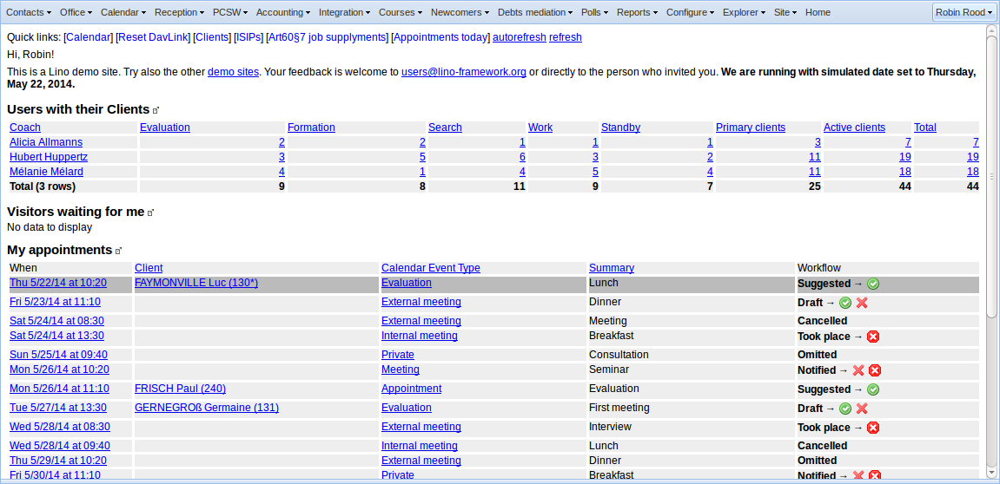

=========================
Monday, November 30, 2015
=========================

Creating screenshots from the command-line
==========================================

Cool! I got a first visible success for :ticket:`632`!

Thanks to Baiju Muthukadan's `Selenium with Python
<http://selenium-python.readthedocs.org>`_ tutorial, I was able to
write the following script that logs in and creates a screenshot.

I tested the following code using::

  $ go blog
  $ cd docs/blog/2015
  $ python -m doctest 1130.rst

Before running this, I manually invoked a Welfare server in a separate
terminal::

  $ cd lino_welfare/projects/std
  $ runserver

Now here is the code:

>>> from selenium import webdriver
>>> from selenium.webdriver.common.keys import Keys
>>> from selenium.webdriver.common.by import By
>>> from selenium.webdriver.support.ui import WebDriverWait
>>> from selenium.webdriver.support import expected_conditions as EC

Start a Firefox instance:

>>> driver = webdriver.Firefox()
>>> # driver = webdriver.PhantomJS()

Point the driver to an URL where Lino Welfare is running:

>>> # driver.get("https://welfare-demo.lino-framework.org/")
>>> driver.get("http://127.0.0.1:8000/")

>>> print(driver.title)
Lino Welfare

Click the :guilabel:`Log in` button:

>>> elem = driver.find_element(By.XPATH, '//button[text()="Log in"]')
>>> elem.click()

Enter "robin" as username and "1234" as password, then type ENTER to
submit:

>>> elem = driver.find_element(By.NAME, 'username')
>>> elem.send_keys("robin")
>>> elem = driver.find_element(By.NAME, 'password')
>>> elem.send_keys("1234")
>>> elem.send_keys(Keys.RETURN)

Clicking the :guilabel:`Log in` button linked to local javascript
which opened the Login window. But submitting it caused at least one
AJAX call. So we must wait until they returned.  There is a whole
chapter about `Waiting
<http://selenium-python.readthedocs.org/waits.html>`_ in the tutorial.

>>> # print(driver.page_source)
>>> elem = WebDriverWait(driver, 10).until(
...     EC.presence_of_element_located((By.NAME, 'integ.UsersWithClients.grid')))
>>> print(elem.text)  #doctest: +NORMALIZE_WHITESPACE
Coach Evaluation Formation Search Work Standby Primary clients Active clients Total
Alicia Allmanns 2 2 1 1 1 3 7 7
Hubert Huppertz 3 5 6 3 2 11 19 19
Mélanie Mélard 4 1 4 5 4 11 18 18
Total (3 rows) 9 8 11 9 7 25 44 44

Note how I used the `name` attribute
(:class:`integ.UsersWithClients.grid
<lino_welfare.modlib.integ.UsersWithClients>`) to identify the
element. For this to be possible I had to change
:meth:`lino.core.tablerequest.TableRequest.dump2html` so it adds the
name attribute each time.

We can write a screenshot to a file:

>>> driver.get_screenshot_as_file('1130.png')
True

And when everything worked well, the image has been created:

No cookies are being used:

>>> driver.get_cookies()
[]

Close the Firefox window:

>>> driver.quit()

Remarks:

- The script starts a Firefox instance, and you can watch it running.

- With PhantomJS there would be no such window, but PhantomJS has no
  JavaScript and is not capable of rendering ExtJS websites.

A first page with screenshots made using the new technique is `visible
here <https://de.welfare.lino-framework.org/screenshots>`_ (in German).

Next steps: Think how to make this more usable.  I don't plan to
include such tests to the main test suite because they would require
selenium and Firefox (and I guess that would be problematic on Drone
or TravisCI).  I'd rather use this for generating screenshots that can
be used in documentation. Some important questions are how to
integrate them in a more flexible way into the documentation pages.

Problems with rsync
===================

Publishing my blog and any other doctree to :ref:`lf` suddenly stopped to work::

    $ rsync -r --verbose --progress --delete --times --exclude .doctrees ./ user@example.org:~/public_html/blog_docs

The process hangs. When I hit Ctrl-C, I get::

    $ rsync error: unexplained error (code 130) at rsync.c(632) [sender=3.1.0]
    
When I add verbosity, I get one more message before it hangs::

    $ rsync -r -v -v -v --progress --delete --times --exclude .doctrees ./ user@example.org:~/public_html/blog_docs
    opening connection using: ssh -l user example.org rsync --server -vvvtre.iLs --delete . "~/public_html/blog_docs"  (10 args)

A normal ssh to the server works::

  $ ssh user@example.org

Okay, I'll start by doing an upgrade on the server::

    $ sudo aptitude upgrade
    Resolving dependencies...                
    The following packages will be upgraded:
      base-files bind9 bind9-host bind9utils dpkg dpkg-dev dselect fonts-opensymbol ldap-utils libapache2-mod-php5 libbind9-80 libcommons-collections3-java libdns88 
      libdpkg-perl libfreetype6 libgdk-pixbuf2.0-0 libgdk-pixbuf2.0-common libgssapi-krb5-2 libisc84 libisccc80 libisccfg82 libk5crypto3 libkrb5-3 libkrb5support0 
      liblcms1 libldap-2.4-2 liblwres80 libmysqlclient-dev libmysqlclient18 libnspr4 libnspr4-0d libpng12-0 libreoffice libreoffice-base libreoffice-base-core 
      libreoffice-calc libreoffice-common libreoffice-core libreoffice-draw libreoffice-filter-binfilter libreoffice-filter-mobiledev libreoffice-impress 
      libreoffice-java-common libreoffice-math libreoffice-officebean libreoffice-report-builder-bin libreoffice-style-galaxy libreoffice-writer linux-libc-dev 
      mysql-client-5.5 mysql-common mysql-server mysql-server-5.5 mysql-server-core-5.5 php5 php5-cli php5-common php5-curl php5-gd php5-intl php5-mysql python3-uno 
      screen ssl-cert sudo tzdata tzdata-java uno-libs3 unzip ure wordpress wordpress-l10n 
    The following packages are RECOMMENDED but will NOT be installed:
      krb5-locales libfile-fcntllock-perl libreoffice-emailmerge libsasl2-modules 
    72 packages upgraded, 0 newly installed, 0 to remove and 7 not upgraded.
    Need to get 122 MB of archives. After unpacking 868 kB will be freed.
    Do you want to continue? [Y/n/?] 
    ...

    $ sudo reboot

No change.
