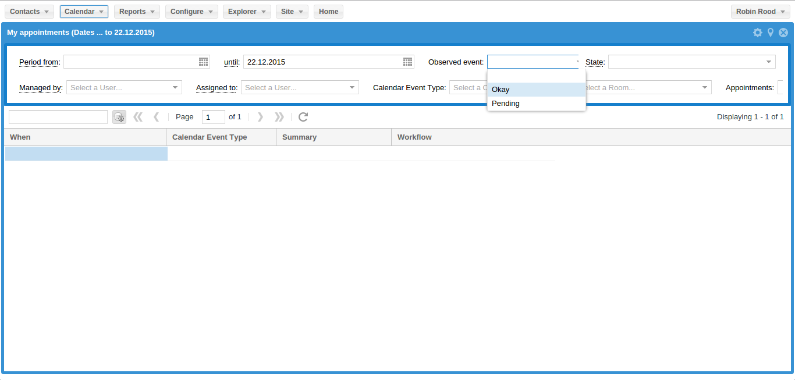

===========================
Saturday, December 19, 2015
===========================

New clothes for Lino
====================

Hamza is progressing on :ticket:`37`.  Here is a screenshot (Note that
ExtJS 6 uses `themes
<https://docs.sencha.com/extjs/6.0/core_concepts/theming.html>`_ and
that this screenshot shows the Neptune theme):

His recent successes:

- Fixed refresh buttons
- Fixed search form on the GridPanel.
- Corrected the 'Ext.form.Basic' inherit so we can call and use the my_loadRecord function. 

We still have a problem with reading the json response into the
GridStore.

Hamza's work is published on `GitHub
<https://gitlab.com/lino-framework/lino_extjs6>`_.
