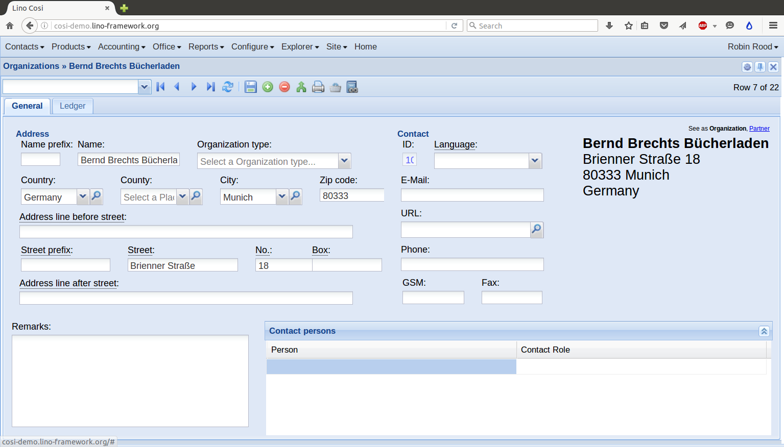
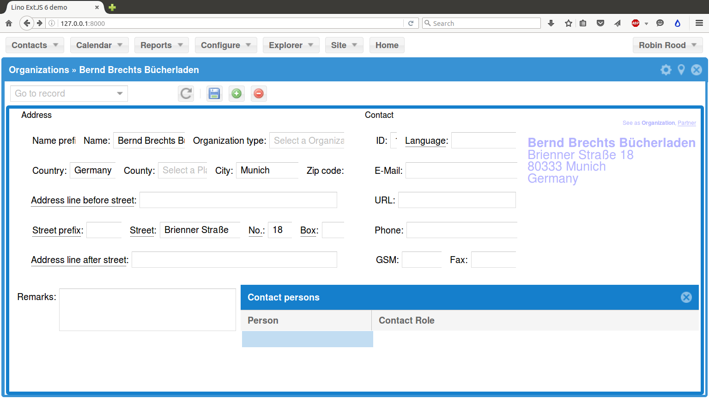

:date: 2016-03-28

======================
Monday, March 28, 2016
======================

Lino's new clothes
==================

I merged Hamza's work into master of :mod:`lino_extjs6` and did a
review. Some remarkas:

- Cool! There is visible progress!
- Yes, changes in the combobox still don't get saved (you were right
  that the problems are not related ;-)

- Why did you remove the `Ext.BLANK_IMAGE_URL` line (in
  `ext_rendered.py
  <https://gitlab.com/lino-framework/lino_extjs6/pull/21/files#diff-3fdac572d50291deba42b6eaa215c710L1424>`_)?
  Is it no longer used?  Did you see `how it was used before
  <https://www.sencha.com/forum/showthread.php?16434-best-place-to-put-Ext.BLANK_IMAGE_URL>`_?

- Did you notice that the `elems.Container.label_align` attribute does
  not work? Its value is `layouts.LABEL_ALIGN_TOP`, but the labels are
  aligned *left* of their field. Compare "before" and "after" below:

Getting Lino into Apache at welstv
==================================

I had this one in Apache's `error.log`::

  AH01630: client denied by server configuration: /home/lino/mypy/welstv/apache/wsgi.py

Explanation was that I had copied configuration from a pre-2.4 Apache,
but Apache die some incompatible changes in `runtime configuration
<http://httpd.apache.org/docs/2.4/upgrading.html#run-time>`_ syntax.

Then I had this one::

  AppRegistryNotReady: The translation infrastructure cannot be
  initialized before the apps registry is ready. Check that you don't
  make non-lazy gettext calls at import time.

This came simply because Lino (or Django) wanted to return an error
page even before Lino had started up. And that page (of course)
requires translation.

Another one in Apache's `error.log`::

  avahi_entry_group_add_service_strlst("welstv") failed: Invalid host name

It seems that `ServerName` must contain at least one dot while
`ServerAlias` doesn't. So I wrote::

    ServerName foo.welstv
    ServerAlias welstv

This one was funny: I had the following content in my
:xfile:`settings.py` and wondered why I received a Bad Request (400)::

    ALLOWED_HOSTS = [
      'lino',
      '192.168.0.2'
      'welstv',
    ]

