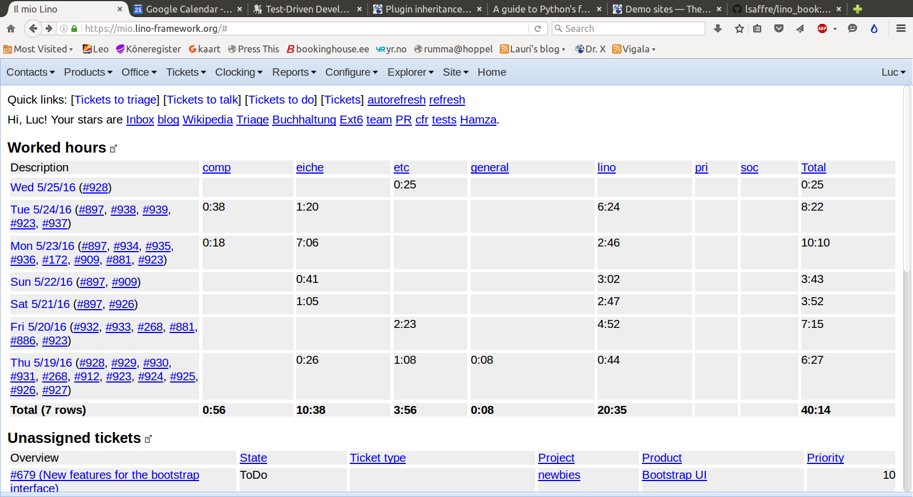

:date: 2016-05-25

=======================
Wednesday, May 25, 2016
=======================

My first serious data loss
==========================

Today I lost five days of production data: The changes to our
ticketing database since last Friday.  This is the first serious data
loss in my career as a system administrator. It took me almost the
whole day to digest this incident: to manually restore the most
important data, to inform Hamza and Alexa, and then (most
time-consuming): to learn from it, i.e. activate snapshot archives on
our production servers and update documentation in :ref:`the Lino
book <book>`.

The reason for this accident is that I started an upgrade at 06:16 the
usual way (:ref:`admin.upgrade`), and having done a snapshot I felt
sure about myself and happily worked on the migrator
(:mod:`lino_noi.lib.noi.migrate`), but forgot that at 06:25 an
automatic cron job creates another snapshot. While I was working, the
cron job started and killed my snapshot.  And this was my only good
snapshot.  I should have done a copy of if before starting to work on
it.

Fortunately I could manually restore the ticket numbers (932 to 939)
and their description because I still hat the main page from before
the upgrade in my browser. By hovering over the ticket numbers of my
:class:`WorkedHours <lino_noi.lib.tickets.ui.WorkedHours>` report, I
could see their descriptions. I saved a screenshot of it:

But the ticket states and summaries, our sessions and comments made
during these 4 days, are gone forever. Hamza will manually create new
estimated sessions because he writes his invoices based on them.
Alexa and I won't do that work since anyway we keep track of our
working times just for fun. I worked about 34 hours during these 4
days (as one can see from above screenshot).

All in all we can be lucky that we lost only 5 days. We are also lucky
that it happened only on our own data and not with a customer
database.  And I learn from it how to avoid this kind of problem in
the future. This incident also confirms that I should get Jüri into
our team. He will help me to do the system admin jobs and to make
everything more secure.

A migrator for Lino Noi
=======================

I changed the version of :ref:`noi` from 0.0.1 to 1.0.1 and wrote a
migrator in new module :mod:`lino_noi.lib.noi.migrate`.

I also wrote and tested the new :func:`override
<lino.utils.dpy.override>` decorator.

Updated documentation pages
===========================

Today's incident made me dive into the documentation targeted to
system administrators, especially thinking at :ref:`jt` who is maybe
going to be our first :ref:`team.admin`.

- :xfile:`make_snapshot.sh`
- :ref:`admin.upgrade`
- :ref:`admin.snapshot`
- :ref:`admin.shell_scripts`
- :ref:`lino.dev`
- and more...

