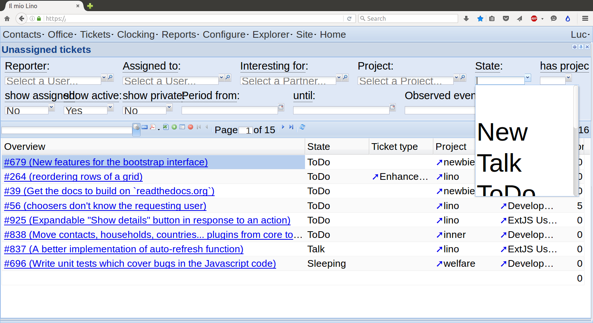
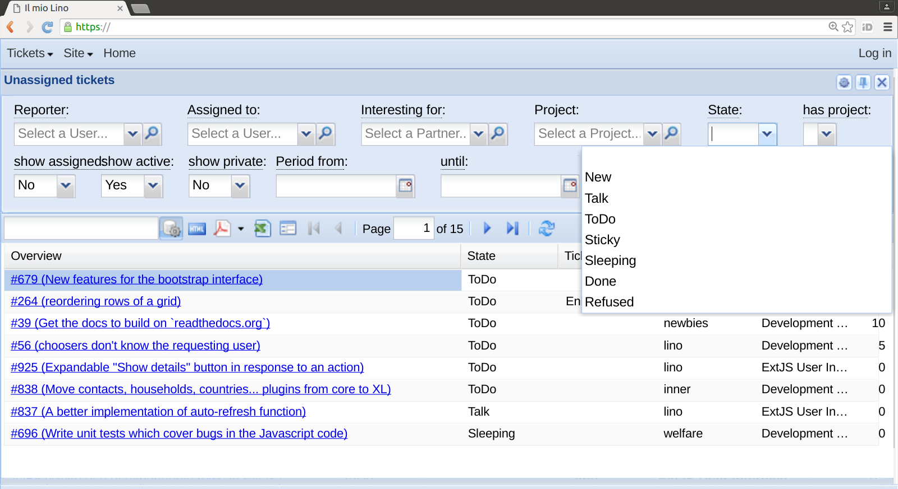

:date: 2016-06-04

======================
Saturday, June 4, 2016
======================

Wrong zooming behaviour on Firefox
==================================

I opened :ticket:`957`. When using Firefox on a Lino site (Sencha
ExtJS), the screen renders correctly only with Zoom 0%. When I zoom,
then some parts of the controls don't resize.

Here are two screenshots (on the left: how it now looks, right: how it
should look):

  
It started some days ago, maybe after upgrading to `Firefox 46.0.1
<https://www.mozilla.org/en-US/firefox/46.0.1/releasenotes/>`_

It seems that neither Alexa nor Hamza have the problem.

I tried to clear my cache, to disable my plugins,... no success yet.

Default folder for saving screenshots
=====================================

Question: On Ubuntu, the folder where to save a screenshot after
:kbd:`Alt+PrintScrn` is :file:`~/Pictures`. How can I change the
default value to :file:`~/Downloads`?

Answer::

  $ gsettings set "org.gnome.gnome-screenshot" "auto-save-directory" "file:///home/$USER/Downloads"

Source: `Default save directory for gnome-screenshot?
<http://askubuntu.com/questions/114429/default-save-directory-for-gnome-screenshot>`__

Starting invoicing plans
========================

I opened and fixed :ticket:`958`. TODO: test it.

Checking for membership payments
================================

Added a new data checker
:class:`lino_voga.projects.roger.lib.courses.models.MemberChecker` and
updated :ref:`voga.specs.roger`, including some demo fixtures.

