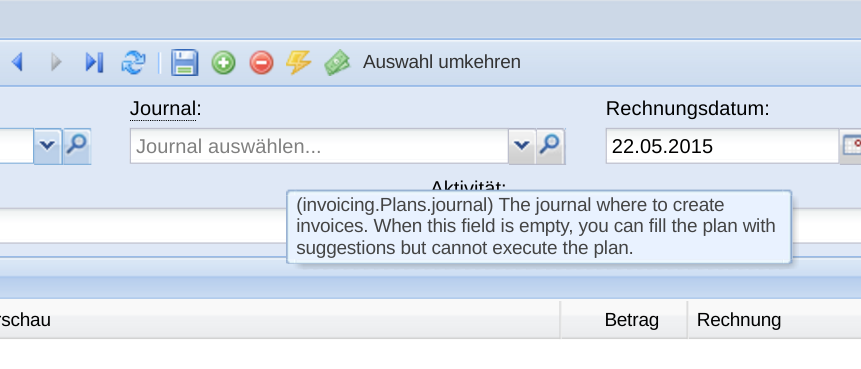

:date: 2016-06-20

===============================
20160620 (Monday, 20 June 2016)
===============================

I opened ticket:`983` and started to work on it.  Mainly a mail to
Sante. Added a concept in :ref:`belref`.

Stupid problems are hard to solve
=================================

Alexa and I were surprised to see that Lino did not suggest a new
invoice for a given enrolment in their database. I wrote the following
script in order to explore the phenomen::

    from __future__ import print_function
    from lino.api.shell import *
    from lino.utils.xmlgen.html import E

    obj = courses.Enrolment.objects.get(id=82)
    print(obj)
    print(E.tostring(obj.invoicing_info))
    ii = obj.get_invoicing_info()
    print(ii.used_events.count(), "used events:", ', '.join([dd.fds(e.start_date) for e in ii.used_events]))

    print(ii.invoicings.count(), "invoicings:", ', '.join([str(i.voucher) for i in ii.invoicings]))

    print(ii.invoiced_events, "invoiced events")
    print("Invoiceable fee:", ii.invoiceable_fee)

After more than one hour of research, I found the explanation:

    Die dümmsten Probleme sind manchmal am schwierigsten zu finden!
    Also erstens waren ja noch nicht alle Termine bestätigt (das hatte
    ich dir schon gesagt), und zweitens stand das Datum in meinem
    Fakturationsplan noch auf 06.07.2016. Am 06.07. war ja in der Tat
    noch nicht das dritte Abo fällig.

    Ich habe Lino jetzt so geändert, dass er das Feld "Rechnungsdatum"
    immer par défaut auf den heutigen Tag stellt.  Und im allgemeinen
    empfehle ich, dass ihr "Fakturierbare bis" leer lasst (denn das
    bedeutet, dass er das Rechnungsdatum nimmt).
    
Nevertheless I also fixed a bug in
:class:`lino_voga.lib.courses.models.InvoicingInfo` which did not yet
apear in their database but which caused some changes in the demo
database. (TODO: analyze and adapt these failures).

Load the help_text of database fields from the Sphinx docs?
===========================================================

Today I worked almost 4 hours for :ticket:`985`, a rather spontaneous
idea and a long-term investment.

It is a new module :mod:`lino.sphinxcontrib.help_text_builder`.

As an example, the :attr:`lino_cosi.lib.invoicing.models.Plan.journal`
field is defined in the docstring using an ``attribute`` directive.
Now the first paragraph of that directive can be automatically used as
the fields `help_text`:

The advantage is that I don't need to write (and maintain) these texts
twice.

TODO:

- make it more automatic (:cmd:`inv bh`)
- Write usage documentation for developers
