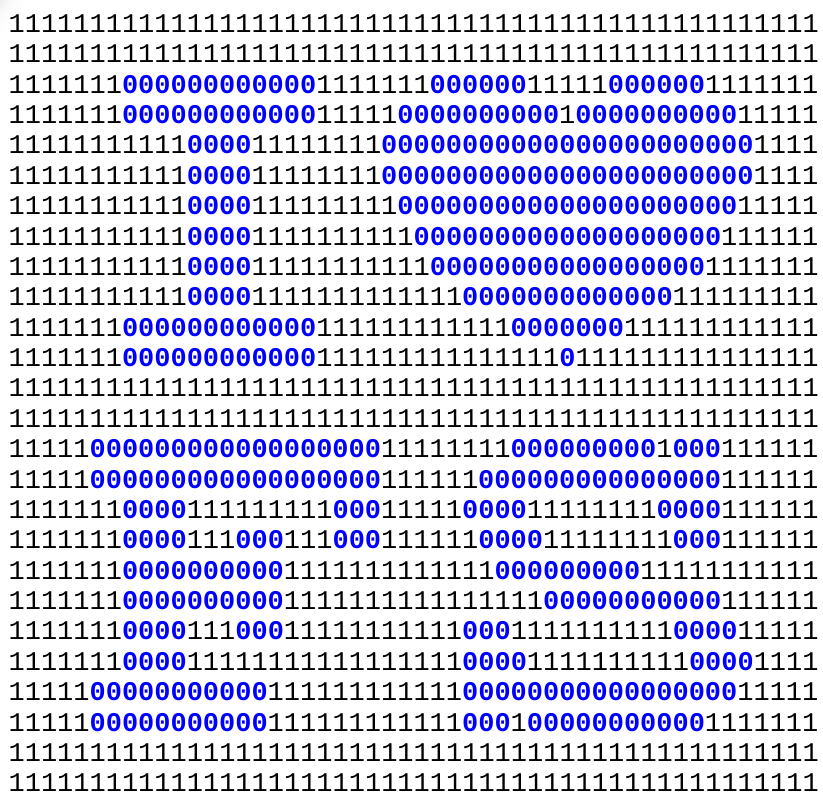

:date: 2016-09-04

=========================
Sunday, September 4, 2016
=========================

I love Free Software
====================

I liked the following graphic from the `Artwork
<https://fsfe.org/campaigns/ilovefs/artwork/artwork.en.html>`__ page
of the *I love Free Software Day* campaign:

.. raw:: html
         
     

But I wanted to play with the idea. Since I didn't find anywhere the
plain text version of it, I used my fingers to type that sequence of
`0` and `1` into a text file :file:`ilovefs-ascii.txt`:

.. literalinclude:: ilovefs-ascii.txt

Then I wrote a little script :file:`ilovefs-ascii.py`:
                    
.. literalinclude:: ilovefs-ascii.py

And now I have it in colored:                    
                    

           
