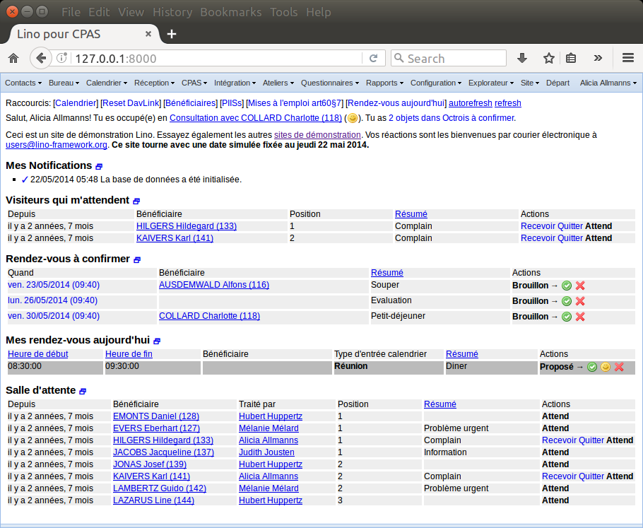

:date: 2017-01-04

==========================
Wednesday, January 4, 2017
==========================

Online registration
===================

I committed a series of changes with my unfinished work on
:ticket:`1307`:

- 2017-01-04 07:49 : `lino <http://www.lino-framework.org>`__
  `4ef1317 <https://github.com/lino-framework/lino/commit/d243decfaef381299a2117c778bec28d94ef1317>`__
- 2017-01-04 07:49 : `lino_xl <http://www.lino-framework.org>`__
  `95b7267 <https://github.com/lino-framework/xl/commit/de4df0c680c35e7fa70836dc76fb9aa2095b7267>`__
- 2017-01-04 07:50 : `lino_noi <http://noi.lino-framework.org>`__
  `c5d8dfd <https://github.com/lino-framework/noi/commit/ee5a137bf8e7abc67f0195bc67ec2a7d0c5d8dfd>`__
- 2017-01-04 07:50 : `lino_book <http://www.lino-framework.org>`__
  `2bc75e7 <https://github.com/lino-framework/book/commit/2ce836eb4e3a780d6023d27e12b601a502bc75e7>`__
- 2017-01-04 07:50 : `lino_welfare <https://welfare.lino-framework.org>`__
  `aa3c70d <https://github.com/lino-framework/welfare/commit/4bfcaab7f6fe196d33309ac3e4448abb8aa3c70d>`__ Merge branch 'master' of git+ssh://github.com/lino-framework/welfare
- 2017-01-04 07:50 : `lino_welfare <https://welfare.lino-framework.org>`__
  `8b86f55 <https://github.com/lino-framework/welfare/commit/dd3e7334411ffe3042cee0394b6e8e6628b86f55>`__

I knew that the ticket is a challenge for Lino. Managing users is a
quite complex chapter, and Lino was until now very minimalistic there
because it was being used only in intranets.

Restore old icons for event states
==================================

I did :ticket:`1343`:

- 2017-01-04 08:10 : `lino <http://www.lino-framework.org>`__
  `87b4755 <https://github.com/lino-framework/lino/commit/cc8f16073e47049c9c7b649c239b074bb87b4755>`__ added new option use_silk_icons
- 2017-01-04 08:11 : `lino_xl <http://www.lino-framework.org>`__
  `0bbd93b <https://github.com/lino-framework/xl/commit/6f2cdfcf7615d54c24669e5bdfbac89b70bbd93b>`__ use new option use_silk_icons in cal workflow
- 2017-01-04 08:11 : `lino_welfare <https://welfare.lino-framework.org>`__
  `fd94266 <https://github.com/lino-framework/welfare/commit/74869476bb7ed57c71be691a680d8286afd94266>`__ tried new option use_silk_icons

Yesterday I thought to do this with Hamza because (1) it's an
interesting example of how taste can differ between developers and
end-users and (2) because he would have helped me with scanning the
git history in order to find the place where I removed the icons. But
I solved (2) on my own (thanks to `this discussion on SO
<http://stackoverflow.com/questions/5128866/git-relative-revision-numbers>`__)::

  $ go xl
  $ git diff master~50 lino_xl/lib/cal/feedback.py

And concerning (1) it is more efficient to take two screenshots and
document it also for future generations of Lino developers:

           

Above screenshots illustrate what our new attribute
:attr:`lino.core.site.Site.use_silk_icons` means.
           
I had fallen in love with the new icons (which actually are no icons
but unicode symbols) because they are less intrusive, can be copied
into documentation text, ... but I agree that it was naive to believe
that end-users would feel as me.

Notification system
===================

Still fiddling with the notification system.  I added a new field
`notify_myself` (:ticket:`1278`) because at least during the current
testing and development phase I want to get notified about my own
actions, this will simplify things.

The Team variant or :ref:`noi` now also uses online registration
(i.e. :mod:`lino_noi.lib.users`). This is not so much because we want
this, but because otherwise I would have to write yet another user
detail for the Team variant.
