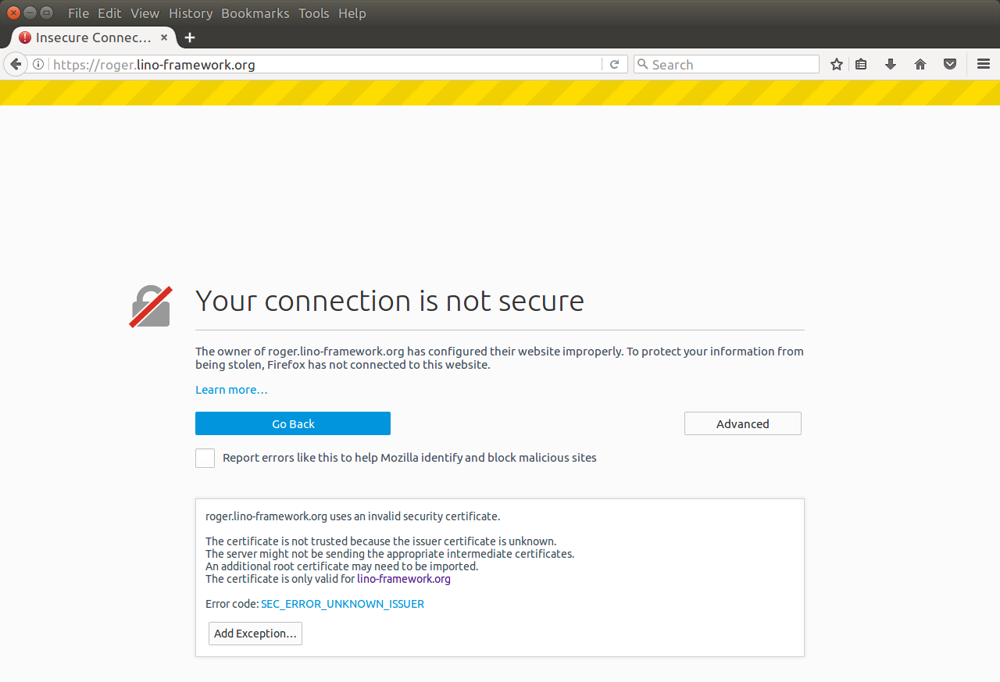
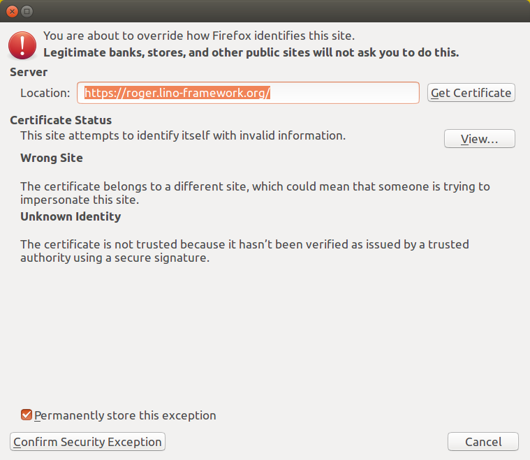
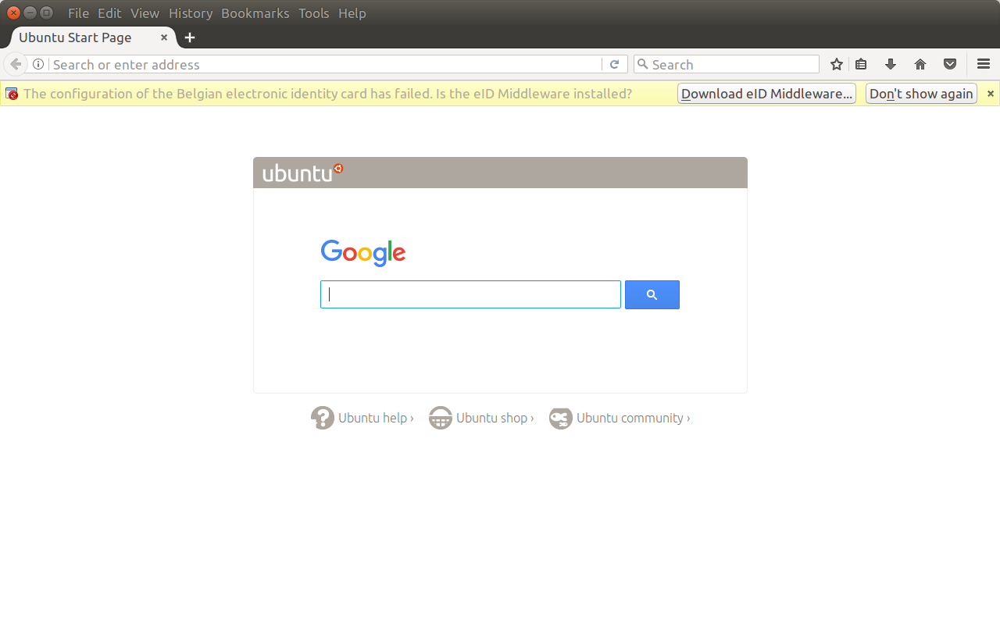

:date: 2017-02-22

============================
Wednesday, February 22, 2017
============================

Rumma & Ko status report
========================

I wrote a `status report
<https://www.saffre-rumma.net/posts/20170222/>`__ as a blog entry on
our company website.

My Firefox and the demo sites
=============================

I observed that :ticket:`957` happens actually only on my machine.  So
I tried to `reset my Firefox
<https://support.mozilla.org/t5/Procedures-to-diagnose-and-fix/Refresh-Firefox-reset-add-ons-and-settings/ta-p/23405>`_
in order to see whether this fixes the problem.  And yes: this is the
solution.

Before getting this result I had some adventures after resetting my
Firefox.  I was testing on the following demo site:

   http://roger.lino-framework.org/

After the reset, Firefox showed only a blank page and the JS console
says "ReferenceError: Ext is not defined". The network log then
revealed that GET http://static.lino-framework.org (unsecured) was
being redirected to https://static.lino-framework.org (secure).

I fixed this by changing the Apache config : the http version of
static no longer redirects to https but serves the same
DocumentRoot. Why not. I just don't understand why it had been working
before. Maybe the certificate has expired? But why then did I not get
a reminder?

After manually changing the `http` of above URL to `https`, I saw
problems similar to what Tonis had recently (:ticket:`1423`) and took
some screenshots:

Another observation after the reset is an error message "The
configuration of the Belgian electronic identity card has failed. Is
the eID Middleware installed?":

I guess that some long time ago I clicked on the "Dont show again"
button and that's why the message shows up now again.

A series of changes in Lino Noi
===============================

Today I didn't have enough time to finish that series of changes which
I started yesterday. So the world won't see them before tomorrow.

The two Presto projects were using :mod:`lino_noi.lib.noi.workflows`
as their :Attr:`workflows_module`. This didn't work anymore because
that workflows module requires also votes.
