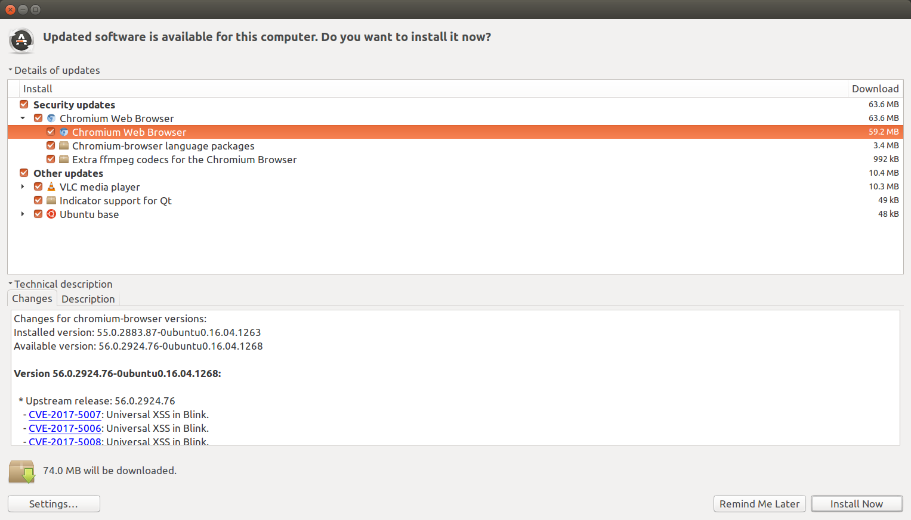

:date: 2017-03-02

=======================
Thursday, March 2, 2017
=======================

Avanti
======

Time passes so quickly!  It is already 2 weeks ago that we had
(:doc:`our second Avanti visit <0217>`) and only now I find time to
start working on that to-do list! But here we go finally
(:ticket:`1492`).

Side effect:

- EventGenerator is no longer UserAuthored because it caused a
  SystemCheckError :message:`avanti.Client.user: (models.E006) The
  field 'avanti.Client.user' clashes with the field 'user' from model
  'contacts.Partner'.`

DONE:

- Benutzer verpflichten können, ihr Passwort zu ändern: interessant,
  aber für Avanti momentan nicht nötig.
- Fehlermeldung nach Eingabe Coaching HB (was war das?)

- (voraussichtlich doch nicht nötig) Neue Benutzerart "Auditor"
  (Janina) : kann alles außer ganz private Daten sehen aber nichts
  ändern.

- 3 Dienste in Demo-Datenbank anlegen
  
- Kommentare nicht öffentlich zeigen.
  
- Bilanzgespräche alle 3 Monate : Termine automatisch generieren.
  
- Kommentare so umbauen, dass sie nicht pro Ticket sondern pro Klient
  (anstelle der Notizen) stehen. Neues Feld `CommentType`
  (z.B. Telefongespräch, ...)

TODO:  
  
- Wenn es keinen Benutzer gibt, der auf den Kursleiter zeigt, dann
  muss der Kursverwalter zum Terminverwantwortlichen werden.

- Die Anfragen sind eigentlich nur eine Liste der Themen, mit denen
  der Sozi mit dem Klienten reden will.
- Neues Feld "Aufenthaltstitel" pro Klient
  
- New user type Coordinator ("Kurskoordinator") has permission to edit
  calendar events of everybody without seeing contact data of
  participants.
  
- Es gibt zwei Grade von Privatdaten : (a) z.B. Kursleiter sollen nur
  die Namen ihrer Teilnehmer sehen, aber nicht mehr, und natürlich
  auch keine Liste der anderen Klienten. (b) Bemerkungen, Notizen,
  Anfragen des Klienten sind nur für Benutzer mit Schweigepflicht
  sichtbar. Selbst der Auditor will die nicht sehen.

- Remove field `Event.assigned_to`
- Remove field `Course.end_date`
- Remove fields `Course.every_unit` and `Course.every`
- Remove `num_places` from `Enrolments.insert_layout`
- Use the Voga StatusReport also for Avanti
  
- Primärbegleiter : Lino zeigt nur die Nummer
- CoachingTypes : drei überflüssige Felder rausholen
- Make Partner inherit from `UserAuthored`, and add a checker to
  verify whether `Client.user` is the current primary coach.
  
- params_panel default hidden for Clients
- ClientContactsByOrganisation
  

Organizing release notes
========================

This morning the Ubuntu upgrade manager showed me the following
screen:

I want to have something like this for Lino, too! ;-)
I opened :ticket:`1539`.
           

Meeting with Tanel
==================

Tanel and I started :ticket:`1540` and did more encoding work.

