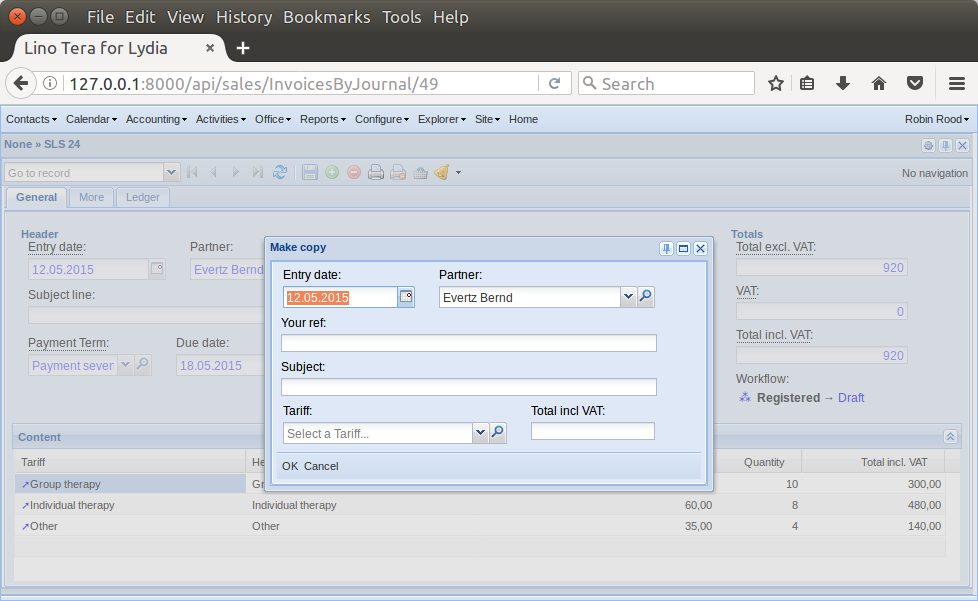

:date: 2017-09-06

============================
Wednesday, September 6, 2017
============================

Django querysets with UNION not supported on MariaDB
====================================================

Yes, it seems that Django querysets with UNION are not supported on
MariaDB. But I fixed the problem by changing to PostgreSQL which
supports them.

Possible side effect also on systems using MySQL: the :manage:`initdb`
command now calls :manage:`migrate` twice: once without and once with
the `--run-syncdb` option.  The help text of that option says that it
"Creates tables for apps without migrations", but I am not sure what
it does for apps *with* migrations. It seems that this has changed
recently.

I could not test whether they work on MySQL because switching from
MariaDB to MySQL is not trivial on Jessie, and anyway MySQL is no
longer available on Debian Stretch (`source
<https://mariadb.org/debian-9-released-mariadb-mysql-variant/>`__).

Try PostgreSQL.
My notes while doing https://wiki.debian.org/PostgreSql

It is better to have your locales correctly working before you install
postgresql::

    $ sudo apt-get install postgresql postgresql-client
    ...
    Setting up postgresql-common (165+deb8u2) ...
    locale: Cannot set LC_ALL to default locale: No such file or directory
    Adding user postgres to group ssl-cert

    Creating config file /etc/postgresql-common/createcluster.conf with new version

    Creating config file /etc/logrotate.d/postgresql-common with new version
    Building PostgreSQL dictionaries from installed myspell/hunspell packages...
      en_us
    Removing obsolete dictionary files:
    Setting up postgresql-9.4 (9.4.13-0+deb8u1) ...
    Error: The locale requested by the environment is invalid.
    Error: could not create default cluster. Please create it manually with

      pg_createcluster 9.4 main --start

    or a similar command (see 'man pg_createcluster').
    update-alternatives: using /usr/share/postgresql/9.4/man/man1/postmaster.1.gz to provide /usr/share/man/man1/postmaster.1.gz (postmaster.1.gz) in auto mode

    $ sudo dpkg-reconfigure locales
    $ pg_createcluster 9.4 main --start
  

Both the default database user and default database are called postgres.

    $ sudo su - postgres

Create a PostgreSQL user and database::

    $ createuser django
    $ createdb -O django mydb

https://www.postgresql.org/docs/9.5/static/database-roles.html    

Install Python packages::    
    
    $ pip install psycopg2

Set password::

    $ sudo su - postgres
    $ psql mydb

Show eisting users::    

    spzdb=# \du
                                 List of roles
     Role name |                   Attributes                   | Member of 
    -----------+------------------------------------------------+-----------
     django    |                                                | {}
     postgres  | Superuser, Create role, Create DB, Replication | {}
    
    SELECT rolname FROM pg_roles;
    ALTER ROLE django with password '123';

    
Now let's go::
  
    $ python manage.py run snapshot/restore.py

There were of course a few surprises because this was the first time
for Lino to collaborate with PostgreSQL:
  
- Exception: Not tested for 'django.db.backends.postgresql'
    
- django.db.utils.OperationalError: cannot drop the currently open
  database

  Thanks to `stackoverflow
  <https://stackoverflow.com/questions/3327312/drop-all-tables-in-postgresql>`__
  where I found that the following should do::

    select tablename from pg_tables where schemaname = 'public';
  
  I then still had a "django.db.utils.ProgrammingError: relation
  "django_content_type" does not exist" which disappeared after a
  manual :manage:`migrate`::

    $ python manage.py migrate
    Operations to perform:
      Apply all migrations: contenttypes, sessions
    Running migrations:
      Applying contenttypes.0001_initial... OK
      Applying contenttypes.0002_remove_content_type_name... OK
      Applying sessions.0001_initial... OK
    $

  It seems that this was because of a syntax error in my DROP
  TABLE statement. Seems fixed now.

- The restore seems very slow. Is there a way to bypass integrity
  checks? I read `this thread
  <https://stackoverflow.com/questions/38112379/disable-postgresql-foreign-key-checks-for-migrations>`__
  and used `DISABLE TRIGGER ALL`, but still it takes half an hour to
  restore their database::

    real     29m18.932s
    user     23m10.648s
    sys	     0m50.460s
  

Optimizing entry of invoices
============================

I wrote an action :class:`lino_xl.lib.sales.models.MakeCopy` for
:class:`lino_xl.lib.sales.models.VatProductInvoice`.  Lydia must to
enter a hundred invoices, and this action will make her task less
painful.  Now she needs only one mouse click per invoice (on the [⁂]
button), everything else can be done using the keyboard.

More user instructions:           
       
- If you leave empty the fields "Tariff" and "Total incl VAT", then Lino
  copies the content of the current invoice to the new invoice.

- If you specify a "Total incl VAT", then the new invoice will have
  only one row. If you leave product empty, then that row will have
  the product of the first row.  NB: the verbose_name of
  products.Product is "Tariff" in :ref:`tera`.

Implementation notes:

This is a quick first solution.  TODO: how to implement something
similar more generally also for other invoice models.

This is a :ref:`dialog action <dialog_actions>`. TODO: write general
documentation.

The action button is currently [⁂].  The button must in the
:attr:`workflow_actions` (cannot be in the toolbar) because otherwise
the default values are not filled in (:ticket:`1336`).

I fixed a bug in :xfile:`linoweb.js` which caused the ActionFormPanel
to not submit when ENTER key was pressed.  TODO: check whether this
needs to be done in ExtJS 6 as well.

Courses with two teachers
=========================

Johanna told me that they have cases where two teachers share one
course. Ticket :ticket:`2042`. One idea is to create a user for every
effective pair of teachers and give each individual teacher an
Authority to work as that user.

Misc Optimizations for :ref:`avanti` (:ticket:`2035`):

- Added a panel "Presences" (:class:`lino_xl.lib.cal.GuestsByPartner`) to
  :class:`avanti.ClientDetail`
         
- The chooser for :class:`lino_xl.lib.courses.Enrolment.course` now shows
  only *active* courses (i.e. whose CourseState.active is True.
  
- :class:`lino_xl.lib.courses.ActivitiesByTopic` now shows only active
  courses by default. Users can see them all by opening the slave
  table in its own window and setting show_active parameter to empty.
  As a result, also StatusReport (which uses this table) shows only
  active courses.
  
DONE:

- Lehrer sollen die Liste "Alle Aktivitäten" nicht sehen
  
- Anna Fallalala kann noch immer nicht gelöscht werden, weil sie jetzt
  noch Anwesenheiten hat. Und die sind nirgendwo sichtbar.
  
- Einfügen in Einschreibungen pro Klient : abgeschlossene und inaktive
  Kurse sollten dort nicht angezeigt werden.
  
- Im Statusbericht auch nur die aktiven Kurse anzeigen (also
  abgeschlossene und inaktive Kurse nicht)

- Aktivitäten : Einfügen in Themen : ist nicht toll.​
  
TODO:  
  
- Entwicklungsschritte "Bilanzgespräch" und "Einschreibung in Kurse"
  kann mehrmals pro Klient vorkommen, Lino schimpft dann aber.
  
- Vereinbarung ausdrucken via Lino : Modul "Auszüge"
  aktivieren. Johanna schickt mir ein Modell
  

Tables with a detail_layout but no insert_layout
================================================

API change as a side effect of above: I removed the rule that Lino
used :attr:`detail_layout` for the insert window as well when there's
a :attr:`detail_layout` but no :attr:`insert_layout`.  Manually tested
on :class:`lino_xl.lib.courses.Topics`.  Looks nice.  Ticket
:ticket:`2043`.

