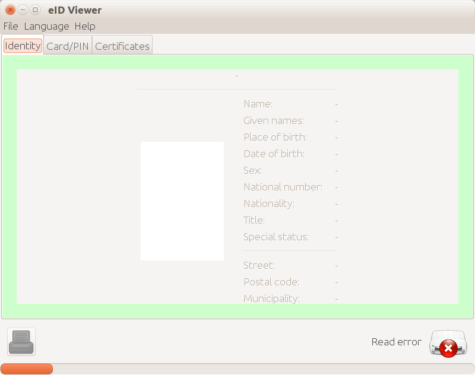

:date: 2017-12-08

========================
Friday, December 8, 2017
========================

Screenshot tours
================

I wrote documentation about :ref:`screenshots tours <dev.tours>`, and
a first example. Which lead to a few code changes in
:mod:`lino.api.selenium`.

The :xfile:`maketour.py` file for team is based on my earlier work in
:ref:`welfare`.  It currently generates only one screenshot because it
fails shortly after that first one. The traceback of this failure
shows that it happens somewhere below `send_keys
<http://selenium-python.readthedocs.io/api.html#selenium.webdriver.common.action_chains.ActionChains.send_keys>`__. I
guess that the Selenium API has changed since I wrote that code.

Note also the file :file:`geckodriver.log` which might contain
interesting information.

Belgian eID card read error
===========================

I discovered that I cannot currently continue to work on
:ticket:`1275` because my Belgian eid card doesn't work.  The Belgian
eID viewer utility (version 4.1.18) says "Read error".

I don't think it is the reader device since I use it often with the
Estonian eid card, and also `pcsc_scan` reports something meaningful::

    $ pcsc_scan
    PC/SC device scanner
    V 1.4.25 (c) 2001-2011, Ludovic Rousseau <ludovic.rousseau@free.fr>
    Compiled with PC/SC lite version: 1.8.14
    Using reader plug'n play mechanism
    Scanning present readers...
    0: Broadcom Corp 5880 [Contacted SmartCard] (0123456789ABCD) 00 00
    1: OMNIKEY AG 3121 USB 01 00

    Fri Dec  8 12:23:25 2017
    Reader 0: Broadcom Corp 5880 [Contacted SmartCard] (0123456789ABCD) 00 00
      Card state: Card removed, 
    Reader 1: OMNIKEY AG 3121 USB 01 00
      Card state: Card inserted, Shared Mode, 
      ATR: 3B 98 13 40 0A A5 03 01 01 01 AD 13 11

    ATR: 3B 98 13 40 0A A5 03 01 01 01 AD 13 11
    + TS = 3B --> Direct Convention
    + T0 = 98, Y(1): 1001, K: 8 (historical bytes)
      TA(1) = 13 --> Fi=372, Di=4, 93 cycles/ETU
        43010 bits/s at 4 MHz, fMax for Fi = 5 MHz => 53763 bits/s
      TD(1) = 40 --> Y(i+1) = 0100, Protocol T = 0 
    -----
      TC(2) = 0A --> Work waiting time: 960 x 10 x (Fi/F)
    + Historical bytes: A5 03 01 01 01 AD 13 11
      Category indicator byte: A5 (proprietary format)

    Possibly identified card (using /usr/share/pcsc/smartcard_list.txt):
    3B 98 13 40 0A A5 03 01 01 01 AD 13 11
            Belgium Electronic ID card

I asked for advice on `eid.belgium.be
<https://eid.belgium.be/fr/contact>`__. I guess that I will need to
get a new card next time I travel to Belgium.
This, :ticket:`1275` must wait.

Third-party authentication
==========================

I added a page :ref:`lino.socialauth` to the developer's guide.
