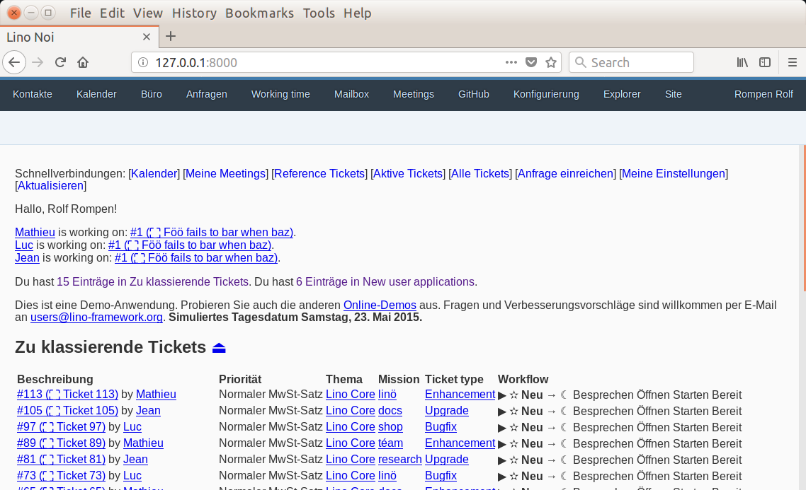

:date: 2018-02-16

=========================
Friday, February 16, 2018
=========================

First pictures of the new :mod:`lino.modlib.openui5` user interface in
action.  We started this project in January because we disagree with
Sencha's policy about the community edition of ExtJS.

               

               

               
           
This is the first Lino module whose author is rather Tonis than Luc,
so I had a problem with writing "Copyright 2018 Luc Saffre" and used
"Copyright 2018 Rumma & Ko Ltd" instead. Actually it should be "OÜ"
rather than Ltd because it is an Estonian company, but I guess that
the non-ascii character might cause trouble.

Moved code from Lino to new package "etgen"
===========================================

Hamza is working on :ticket:`1199`. While reviewing his last pull
request (`lino 82 <https://github.com/lino-framework/lino/pull/82>`__
I noticed that the packages :mod:`lino.utils.xmlgen` and
:mod:`lino.utils.html2rst` actually don't need anything from Lino.  We
should move them out of Lino into an independent package to make them
available for people who don't care about Lino.

- I created and published a new package :ref:`etgen`
- I removed :mod:`lino.utils.xmlgen` and :mod:`lino.utils.html2rst`
  from Lino and adpated Lino to use :ref:`etgen`.
- Removed :mod:`lino.utils.xmlgen.cbss` completely (this was some early
  study which has never been used in production)

Of course this causes lots code changes in the other projects. For
example the well-known line::

    from lino.utils.xmlgen.html import E

is now::

    from etgen.html import E
    
