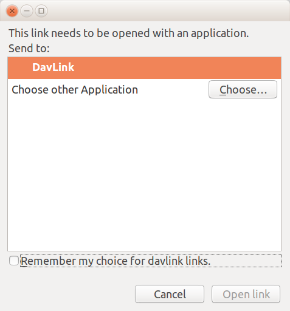

:date: 2018-03-31

========================
Saturday, March 31, 2018
========================

Defining Davlink as a custom URL protocal handler
=================================================

The Linux instructions on the `shotgunsoftware.com
<https://support.shotgunsoftware.com/hc/en-us/articles/219031308-Launching-applications-using-custom-browser-protocols?mobile_site=true>`__
seem obsolete, `here
<https://askubuntu.com/questions/514125/url-protocol-handlers-in-basic-ubuntu-desktop>`__
are newer ones.  Thanks also to to the discussion on `Where are file
associations stored?
<https://askubuntu.com/questions/16580/where-are-file-associations-stored>`__

I did the following experiment.

I created an executable file :file:`/home/luc/bin/davlink.sh` with
this content::

  echo "<body>Hello world </body>"
  date >> /home/luc/bin/davlink.log
  
In :file:`/usr/share/applications` I added a file
:xfile:`davlink.desktop` with this content::

    [Desktop Entry]
    Encoding=UTF-8
    Version=1.0
    Type=Application
    Terminal=false
    Exec=/home/luc/bin/davlink.sh %u
    Name=DavLink
    Comment=DavLink handler
    Icon=
    Categories=Application;Network;
    MimeType=x-scheme-handler/davlink;

In my :file:`mimeapps.list` file (the one in :file:`~/.config`, not
the one in :file:`~/.local/share/applications`), I added::

  x-scheme-handler/davlink=davlink.desktop;

I ran :cmd:`update-desktop-database` to build the cache database of
MIME types handled by desktop files.

I point FireFox to davlink://foo.txt and get this dialog:

Looks as if my previous configs were partly useless since FF still
manages its own list of associations.

Anyway: the log file shows that the script is getting executed. But
the browser does not get any feedback.  It just launches the
application and does not return any response.  The process is similar
to downloading a file, except that there is no file being downloaded
before launching the application.

           

TIL:

- Configuring a custom URL handler can be tricky, but with correct
  documentation it should be an acceptable requirement.

- We can use custom url handlers for davlink immediately, but for
  eidreader we need a system where the local script can send back a
  response to the browser.  That's more complex.  `This thread
  <https://stackoverflow.com/questions/13368852/get-custom-protocol-response>`__
  indicates a possible solution: our :xfile:`eidreader.sh` file would
  post its information to the Lino server where it gets stored in the
  file system or a temporary database table using the client's IP
  address, timestamp and :attr:`national_id
  <lino_xl.lib.beid.BeIdCardHolder.mixins.national_id>`.  And the
  "Read eID" button would do a series of two things: (1) invoke
  :xfile:`eidreader.sh` and (2) read from the file system or temporary
  database table.  Not yet sure how to handle the waiting time.
  

-   
