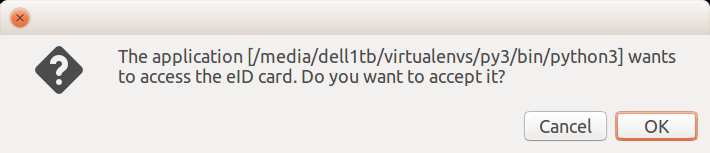

:date: 2018-04-13

======================
Friday, April 13, 2018
======================

I published a new repository `eidreader
<https://github.com/lino-framework/eidreader>`__, a simple
command-line Python script which reads data from a Belgian eID card.
Not to be mixed up with its Java predecessor `eidreader
<https://github.com/lsaffre/eidreader>`__ (same name but on account
lsaffre), which is now deprecated.  I also created a `central project
homepage <http://eidreader.lino-framework.org>`__ and released version
0.0.1 on `PyPI <https://pypi.python.org/pypi/eidreader/0.0.1>`__.

Usage is simple:

  - Install it with :cmd:`pip install eidreader`
  - Insert your eID card into your reader
  - Run the :cmd:`eidreader` command which dumps the data to stdout by
    default.
  
TODO:

Not sure how to get rid of a kind of additional "security alert"
coming from the middleware and which asks for a user interaction:

It seems to be issued by a binary file
:file:`/usr/lib/eid-mw/beid-askaccess`::

    $ ll /usr/lib/eid-mw/beid-askaccess
    -rwxr-xr-x 1 root root 10512 May 20  2016 /usr/lib/eid-mw/beid-askaccess*

Also the output of the command line contains some warning messages
before the output::
           
    sdialog_call_modal: in child
    sdialog_call_modal: DISPLAY=:0
    call_dialog_result: about to exec /usr/lib/eid-mw/beid-askaccess
    Gtk-Message: GtkDialog mapped without a transient parent. This is discouraged.
  
