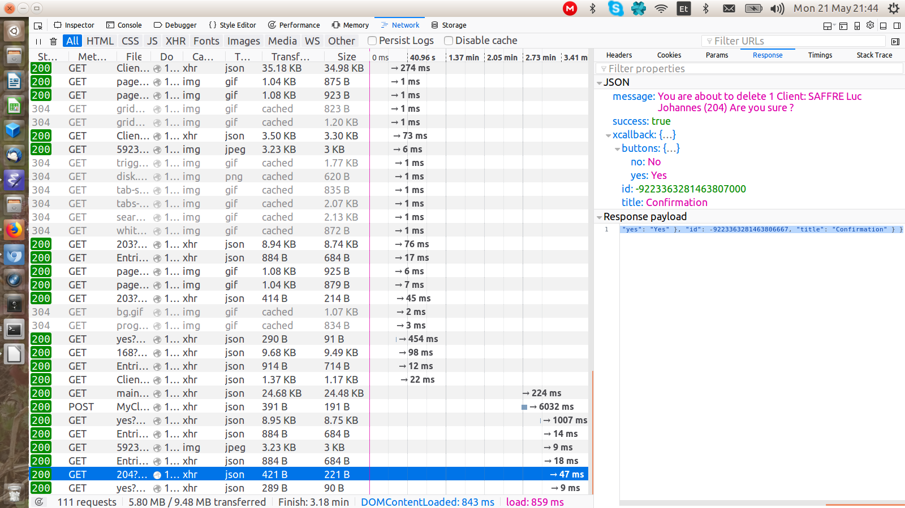

:date: 2018-05-21

====================
Monday, May 21, 2018
====================

Abdelkader getting started
==========================

Abdelkader reported another problem during :cmd:`inv bd` in
:ref:`book`::

    Warning, treated as error:
    /root/lino/repositories/book/docs/dev/invlib.rst:14:undefined label: atelier.invlib (if the link has no caption the label must precede a section header)"

Let's look at line 14 or file `docs/dev/invlib.rst
<https://raw.githubusercontent.com/lino-framework/book/master/docs/dev/invlib.rst>`__. It says::

  of the atelier_ package: :ref:`atelier.invlib`.
  
The :code:`:ref:`atelier.invlib`` there is a Sphinx's
``:ref:`` role.
See `the Sphinx docs <http://www.sphinx-doc.org/en/stable/markup/inline.html#role-ref>`__.
It is used to refer to another page or section.

And indeed, the ``atelier.invlib`` reference requires `intersphinx
<http://www.sphinx-doc.org/en/master/ext/intersphinx.html>`__ because
its target is not inside the ``book`` project, it is in the docs of
``atelier``.

It should refer to the following address:
http://atelier.lino-framework.org/invlib.html#atelier-invlib

The source code of that page is here:
https://raw.githubusercontent.com/lino-framework/atelier/master/docs/invlib.rst

It contains the code ``.. _atelier.invlib:`` before the section
header, that's what you do in Sphinx for defining a reference target.

When Sphinx complains that ``atelier.invlib`` is an unknown reference,
then we can conclude that intersphinx failed to load the index of the
ateler docs tree.

I guess that Abdelkader does not yet use the atelier with my changes
on :doc:`0510` (`Fixed another bug in atelier
<http://luc.lino-framework.org/blog/2018/0510.html#fixed-another-bug-in-atelier>`__).
I released atelier 1.1.8 on PyPI so that he can just do ``pip
install -U atelier``.  Another fix would have been to `switch to the
development version
<http://lino-framework.org/dev/env.html#how-to-switch-to-the-development-version-of-atelier>`__.

Shortly afterwards we discovered another minor bug in atelier.  When
the :xfile:`~/.atelier/config.py` file contains an invalid project
name (i.e. it calls :func:`atelier.projects.add_project` with a
`root_dir` that doesn't exist), the project is being added to the
list, but :cmd:`pp -l` failed::

  AttributeError: 'NoneType' object has no attribute 'configuration'

Now (in the coming version) this configuration error will already
raise an exception when reading the :xfile:`~/.atelier/config.py`
file, making it easier to localize.

Backwards-incompatible change in eidreader
==========================================

Ticket :ticket:`2393` (Wrong error message when no eid card found)
required a backwards-incompatible change in eidreader about the format
used for sending the data to an URL: instead of posting every data
field as a string, eidreader now POSTs the card data as single field
`card_data` whose value is a dict with the same fields as before, only
that it is JSON encoded now.

We also added a new field `message`.  Until now there was only one
explanation for having `success` set to False: no card was inserted in
the reader.  But actually there are other possible explanations:
e.g. a card was there, but the user did not permit access to the
reader.  In that latter case, `message` now contains
"CKR_FUNCTION_FAILED (0x00000006)".

Unknown callback -9223363281463807000
=====================================

I observed for the first time a problem that appears to the end user
as a message of style "Unknown callback -9223363281463807000" after
they have answered to a callback question.  It occurs only
sporadically, and no real user has ever reported something similar.  I
observed it in :mod:`lino_book.projects.adg`.  I opened ticket
:ticket:`2395`.

Some debugging revealed that it comes when the id of callback exceeds
a certain limit::

    20160526 Stored -9223363281463806667 in {-9223363281463809571: Callback('You are about to delete 1 Client:\nSAFFRE Luc Johannes (203)\nAre you sure ?'), -9223363281463806667: Callback('You are about to delete 1 Client:\nSAFFRE Luc Johannes (204)\nAre you sure ?')}
    [21/May/2018 18:27:47] "GET /api/avanti/MyClients/204?_dc=1526927267258&an=delete_selected HTTP/1.1" 200 221
    No callback -9223363281463807000 in [-9223363281463809571, -9223363281463806667]
    [21/May/2018 18:27:48] "GET /callbacks/-9223363281463807000/yes?_dc=1526927268692 HTTP/1.1" 200 90

Python does not seem to have any problem with integers of tht size:

>>> str(-9223363281463806667)
-9223363281463806667

But Javascript seems to have:

Yes, that's the problem: the highes number Javascript can handle is
9007199254740991 (2\ :superscript:`53`). Found `on SO
<https://stackoverflow.com/questions/307179/what-is-javascripts-highest-integer-value-that-a-number-can-go-to-without-losin>`__.
           
Hm, it seems that we need to use something else then the object's hash
as callback id...  and I don't yet understand why this problem occurs
for the first time only now...
