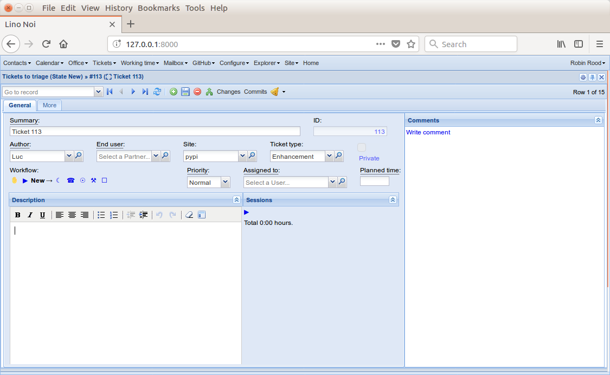

:date: 2018-07-08

====================
Sunday, July 8, 2018
====================

How to implement detail layouts in OpenUI5
==========================================

Yesterday Hamza and I also dived into the generation of XML for detail
layouts (:ticket:`2303`).  As Tonis pointed out earlier, the next
challenge here is that Lino's layout mechanism is *per se* not
designed to be responsive.

For example :class:`TicketDetail <lino_noi.lib.tickets.TicketDetail>`
is currently defined like this::
  
    class TicketDetail(TicketDetail):
        main = "general more"

        general = dd.Panel("""
        general1:60 comments.CommentsByRFC:30
        """, label=_("General"))

        general1 = """
        summary id:6
        user end_user site ticket_type private:10
        workflow_buttons:30 priority:10 assigned_to planned_time
        bottom_box
        """

        bottom_box = """
        description:30 working.SessionsByTicket:20
        """

        more = dd.Panel("""
        more1 DuplicatesByTicket:20
        upgrade_notes LinksByTicket uploads.UploadsByController 
        """, label=_("More"))

        more1 = """
        created modified fixed_since
        state ref duplicate_of deadline
        """

Which is rendered like this:

In OpenUI5 we have the concept of `SimpleForm
<https://openui5.hana.ondemand.com/#/entity/sap.ui.layout.form.SimpleForm>`__
which is a Form control with FormContainers and FormElements, but the
complexity in the API is removed:

- A new Title or Toolbar starts a new group (FormContainer) in the form.
- A new Label starts a new row (FormElement) in the form.
- All other controls will be assigned to the row (FormElement) that
  started with the last label.
- You can specify LayoutData to influence the layout for special cases
  in the Input/Display controls.

We played wiht some `SimpleForm examples
<https://openui5.hana.ondemand.com/#/sample/sap.ui.layout.sample.SimpleForm480_Trial/preview>`__.

We will probably abandon the concept of detail layouts (or extend it)
in order to use SimpleForm.  Basically a detail form would be a <VBox>
containing a <SimpleForm>.  And the application developer must somehow
specify resaonable "layout blocks".

Now I am trying to find out how I would want to define a
:class:`TicketDetail <lino_noi.lib.tickets.TicketDetail>`.

- A detail layout is currently a series of nested panels, each panel
  being either vertical or horizontal.  If the main panel is
  horizontal, the form is tabbed and every 2nd-level panel must have a
  label.

- Lino could automatically decide that the content of a horizontal
  panel is optionally vertical when there is not enough space.

- The `general1` panel in our current TicketDetail is too large.  Lino
  would have difficulties to render this into a reasonable layout on a
  mobile phone.  We can fix this by saying that the application
  developer is responsible for not defining such panels that require
  more width than a mobile device can provide.

Ideas:

- Issue a warning when the minimum width of a horizontal panel in a
  detail layout is bigger than a phone device can provide.

- rename :attr:`lino.utils.jsgen.Value.value_template` to
  `ext_value_template` to express the fact that it is ExtJS-specific.
  
- move jsgen to lino.modlib.extjs?

       
::
  
       summary id

       user end_user
       site ticket_type
       private:10
       workflow_buttons:30
       priority:10 assigned_to planned_time

       description:30
       working.SessionsByTicket:20
       created modified fixed_since
       state ref duplicate_of deadline
       DuplicatesByTicket:20
       upgrade_notes
       LinksByTicket
       uploads.UploadsByController 

       comments.CommentsByRFC:30
       

Select at least a start period
==============================

When a user tried the :class:`AccountingReport
<lino_xl.lib.accounting.AccountingReport>`, Lino raised a
:message:`TypeError: bad argument type: __proxy__(u'Select at least a
start period')` instead of simply saying that message in the report's
body.  This regression was introduced months ago (:doc:`0308`) when we
switched to the `lxml` element trees.  I now wrote a test case to
reproduce this condition (in :ref:`xl.specs.accounting`).  While I was
there I thought to also test what happens when the users specifies an
invalid period range (end before start).  Oops: instead of issuing an
error message, Lino produced some report.  That's not fool-proof
enough for an accounting application, so I changed it: Lino now has a
new method :meth:`check_params
<lino.core.utils.Parametrizable.check_params>` which you can implement
either on an action or on an actor.  Or you can use a
:class:`ParameterPanel <lino.core.utils.ParameterPanel>` for your
`parameters` and implement your own :meth:`ParameterPanel.check_values
<lino.core.utils.ParameterPanel.check_values>` method.  Which is what
we now do for :class:`AccountingPeriodRange
<lino_xl.lib.accounting.AccountingPeriodRange>`.

