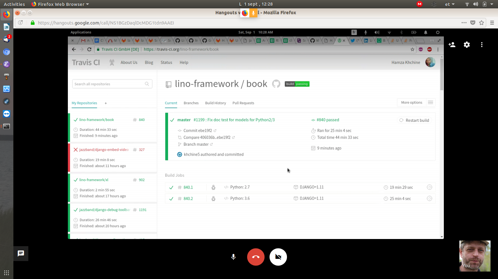

:date: 2018-09-01

===========================
Saturday, September 1, 2018
===========================

Today is a historic day:

This screenshot shows the :ref:`book` test suite having passed on
:ref:`travis` under both Python 2 and 3.  This happened for the first
time in history.  As a consequence I closed :ticket:`36` now.  If new
problems arise, we will create individual tickets for them.

Thanks to Hamza and Gaetan for their work on this.

Of course there is more to do about it.  Actually the latest big issue
was :ticket:`1157`, and this one is only half fixed.  It currently
requires a special line in the :xfile:`requirements-python3.txt`
file::

  -e svn+https://svn.forge.pallavi.be/appy-dev/dev1#egg=appy

as explained on :doc:`0510`.  And I still don't understand every
detail.  For example is the `-e` option needed?

The remaining big problem with :ticket:`1157` is that as long as Appy
for Python 3 is not on PyPI, we cannot ask Lino hosters and
application developers to use Python 3.  They continue to be stuck on
Python 2.  We can say that this is mostly their psychologic problem,
but it becomes our problem since we want them to trust us.

Gaetan wrote "Pour la publication via pip, ce n'est pas encore
prêt. Il faut que la suite de tests complète puisse fonctionner en
Python 3, et je pense que c'est loin d'être le cas. Par ailleurs, bien
que Luc et toi (et pas mal d'autres personnes) n'utilisez que la
partie "pod" d'Appy, il y a beaucoup d'autres parties du framework sur
lequel il reste pas mal de boulot (Appy est un framework complet pour
développer des applis web en Python)."

This shows once more that for us (and those other guys who use only
appy.pod without the whole web framework) Gaetan should split the pod
part of appy out of the appy web framework and start maintaining two
Python packages.  But it seems that he is afraid of doing that
step. Should I try once more to convince him?

Gaetan, my experience shows that it is easier to maintain several
small packages than having one monolythic project.  In the beginning
of Lino I also had one single repository, now the Lino framework
consists of more than a dozen of packages.  I suggest to choose a
completely new name for what is currently needed by appy.pod
e.g. "appytools".  The appytools package would become to appy
something like :ref:`atelier` and :ref:`etgen` are for Lino:
independent little packages maintained by the Lino team, which can be
used by people who don't use Lino.

General release workflow for Lino
=================================

I opened :ticket:`2520` and started to write release notes for
:ref:`v18.8` and :ref:`book.changes`.

Hamza and I noted that the tags created by :cmd:`inv release` were
only local until now.  They exist only on Hamza's machine. For future
releases they should automatically be pushed to become public::

    git push origin v18.8.0

Hamza changed atelier to issue that addditional `git push` command.
He also added the "v" in front of the version number (just because I
have a feeling that numeric tag names might cause issues in git).  He
will review and update the atelier docs before pushing his work.

Now about the deployment workflow (:ticket:`2520`).  This is important
because we want to convince hosters that it is safe to provide stable
hosting for existing Lino applications.

Imagine 18.8.0 is released. And there are hosters with production
sites using that version.  And then some urgent bug is reported.
the production sites don't want to upgrade.

We want to provide a version 18.8.1.

Getting notified about every commit
===================================

I still don't get notified when Hamza or Tonis push some code change
to some repository.  Aha, thanks to `stackoverflow
<https://stackoverflow.com/questions/9845655/how-do-i-get-notifications-for-commits-to-a-repository>`__
I learned that GitHub has an RSS feed I can subscribe to:

- https://github.com/lino-framework/lino/commits/master.atom
- https://github.com/lino-framework/xl/commits/master.atom
- https://github.com/lino-framework/book/commits/master.atom
- https://github.com/lino-framework/avanti/commits/master.atom
- etc

Now that I can more easily review what the others are doing.  I saw
that Hamza used found a better solution for fixing the Python 2/3
problem I recently fixed in :ref:`lino.dev.bd`.  I copied his
solution.

Reviewing Hamza's documentation changes
=======================================

Cool! Hamza committed two changes in atelier together with the
documentation:
https://github.com/lino-framework/atelier/commit/330c6028a43d6146b667e1176e85141cfd090116

But I am nit-picky. I reviewed his changes:
https://github.com/lino-framework/atelier/commit/0174a583238a14e293f9514b5f3342978725fbe9

My comment: the changes.rst should be short and should not repeat what
is written in the docs (so I removed the duplicate text). You forget
to mention that :cmd:`inv release` it now also pushes the version tag.

And then I saw::

    $ inv release --help
    Usage: inv[oke] [--core-opts] release [--options] [other tasks here ...]

    Docstring:
      Publish a new version to PyPI.

      :param bool notag: If it's True, the command will not create a new tag.

    Options:
      -n, --notag

I vaguely remembered that pyinvoke can do better.  A quick
consultation of the `documentation
<http://docs.pyinvoke.org/en/1.1/getting-started.html#adding-metadata-via-task>`__
told me how to make it more elegant::

    $ inv release --help
    Usage: inv[oke] [--core-opts] release [--options] [other tasks here ...]

    Docstring:
      Publish a new version to PyPI.
      See http://atelier.lino-framework.org/invlib.html for details.

    Options:
      -n, --notag   Skip automatic creation of version tag

So I did a second review:
https://github.com/lino-framework/atelier/commit/bf95b199dce1101cd649b423d8fdd0e6ba468005

Hi Hamza, please don't take my perfectionism too personal- actually I
am very glad that you start to write docs.  In a free software
project, documenting what you do is at least as important as actually
doing it.  We all tend to forget this.  One good reason for not always
documenting immediately is that the changes might still be
experimental.

This story also shows the benefits of reviewing the changes of your
team members: it motivated me to think whether I liked Hamza's change.
