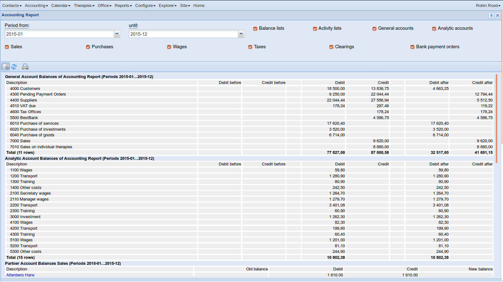
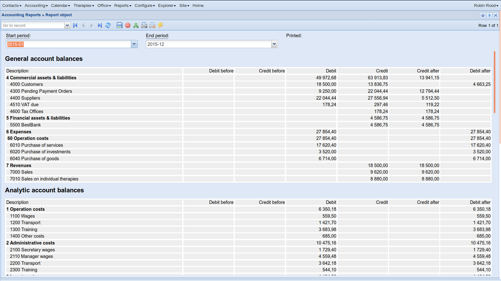

:date: 2018-09-07

=========================
Friday, September 7, 2018
=========================

I did this using :mod:`weasyprint <lino_xl.lib.weasyprint>` instead of
:mod:`appypod <lino_xl.lib.appypod>`. Because appypod templates are
difficult to configure and maintain, and because weasyprint should be
satisfying.

The most visible problem was that amounts (:class:`DecimalField`)
didn't align right in the pdf printout when using weasyprint.  To fix
this, I replaced the cell attributes
(:attr:`lino.core.renderer.HtmlRenderer.cellattrs`) by
``class="text-cell"`` or ``class="number-cell"``, and then define
these classes in currently three places: :xfile:`plain/lino.css`,
:xfile:`extjs/lino.css` and inline in
:xfile:`excerpts/base.weasy.html`. I don't yet see how to unify them
(and whether that's important).

:meth:`lino.core.requests.BaseRequest.show` on a HtmlRenderer did not
render the table header when `header_level` was specified. That
feature was being used only by TextRenderer so far.  Now it is also
used by annual.

We have a new method :meth:`lino.core.requests.BaseRequest.show_story`
which is used in the template for the report
(:xfile:`ledger/Report/default.weazy.html`).

The :meth:`lino.core.renderer.HtmlRenderer.table2story` method now
yields a sequence of elements instead of returning a single one.  

Here are the old and the new reports on screen...

                 
... and their printable pdf versions: `old.pdf
<../../dl/2018/ledger.AccountingReport.pdf>`__ `new.pdf
<../../dl/2018/sheets.Report-1.pdf>`__

TODO: When a model defines a
:meth:`lino.core.model.Model.get_choices_text`
