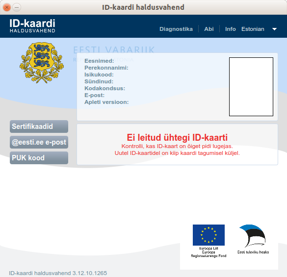
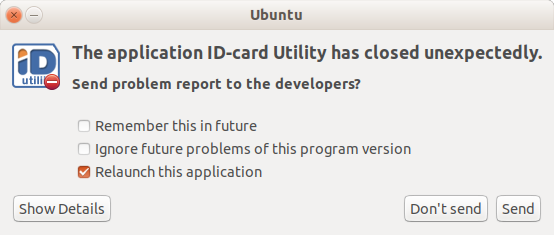
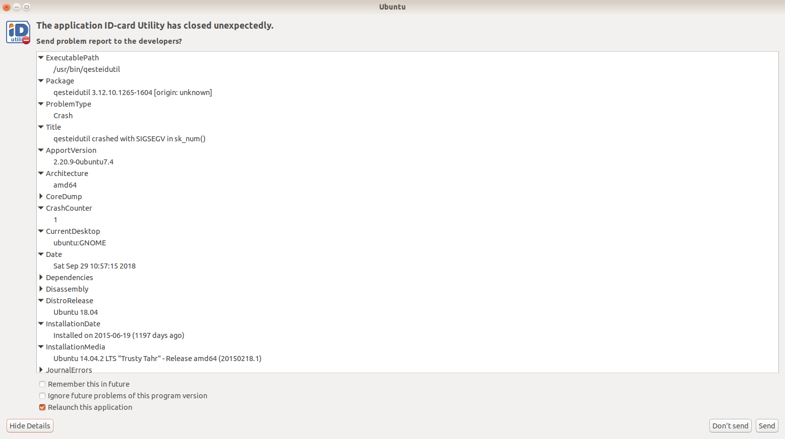

:date: 2018-09-29

============================
Saturday, September 29, 2018
============================

Miscellaneous
=============

I started a new specs document :ref:`xl.specs.appypod`.

Estonian ID-card utility crashes
================================

I can start the Estonian ID-card utility and it opens when there is no
card in the reader.

But when I insert a card, it tries to load it and during loading
happens something which causes the application to crash.
           

           

Then I found `this page <https://www.id.ee/index.php?id=38683>`__
which explains what might have happened and how to fix it: simply
uncomment the line in
:file:`/etc/apt/sources.list.d/ria-repository.list`, then update and
upgrade and ... oops, the problem remains.

The application (as long as no card is inserted) works well and gives
a lot of information::
  

    Keeleseaded: English / en_GB.UTF-8

    Baastarkvara: 3.10.2.1573-1404
    Rakenduse versioon: 3.12.10.1265 (64 bit)
    Operatsioonisüsteem: Ubuntu 18.04.1 LTS
    Protsessor: Intel(R) Core(TM) i7-3740QM CPU @ 2.70GHz
    Tuum: Linux 4.15.0-34-generic #37-Ubuntu SMP Mon Aug 27 15:21:48 UTC 2018 x86_64

    Teegid:
    libdigidoc2 (3.10.4.1218-1804)
    libdigidocpp1 (3.13.6.1371-1804)
    qdigidoc (3.13.6.1525-1604)
    qesteidutil (3.12.10.1265-1604)
    esteidpkcs11loader (3.12.0.1070-1604)
    esteidfirefoxplugin (3.12.1.1142-1510)
    chrome-token-signing (1:1.0.7.498-1804)
    openssl (1.1.0g-2ubuntu4.1)
    libpcsclite1 (1.8.23-1)
    opensc (0.17.0-3RIA1)
    QT (5.9.5)

    Argumendid: qesteidutil
    Teegi otsing: /usr/lib/x86_64-linux-gnu/qt5/plugins;/usr/bin
    URLs:
    BREAKPAD: https://cr.eesti.ee/
    CONFIG_URL: https://id.eesti.ee/config.json

    Konfiguratsiooni andmed:
    DATE: 20180712113011Z
    SERIAL: 68
    URL: https://id.eesti.ee/config.json
    VER: 1

    Smart Card teenuse staatus: Töötab
    Kaardilugejad:
    OMNIKEY AG 3121 USB 00 00 max APDU size 65536
    Reader state: EMPTY
    Broadcom Corp 5880 [Contacted SmartCard] (0123456789ABCD) 01 00 max APDU size 65536
    Reader state: EMPTY

    Veebibrauserid:
    chromium-browser (69.0.3497.81-0ubuntu0.18.04.1)
    firefox (62.0+build2-0ubuntu0.18.04.5)

    USB info:
    Bus 002 Device 003: ID 0a5c:5801 Broadcom Corp. BCM5880 Secure Applications Processor with fingerprint swipe sensor
    Bus 002 Device 002: ID 8087:0024 Intel Corp. Integrated Rate Matching Hub
    Bus 002 Device 001: ID 1d6b:0002 Linux Foundation 2.0 root hub
    Bus 001 Device 004: ID 0c45:643f Microdia Dell Integrated HD Webcam
    Bus 001 Device 003: ID 413c:8197 Dell Computer Corp. 
    Bus 001 Device 002: ID 8087:0024 Intel Corp. Integrated Rate Matching Hub
    Bus 001 Device 001: ID 1d6b:0002 Linux Foundation 2.0 root hub
    Bus 004 Device 001: ID 1d6b:0003 Linux Foundation 3.0 root hub
    Bus 003 Device 003: ID 040b:2000 Weltrend Semiconductor 
    Bus 003 Device 002: ID 076b:3022 OmniKey AG CardMan 3021
    Bus 003 Device 001: ID 1d6b:0002 Linux Foundation 2.0 root hub

