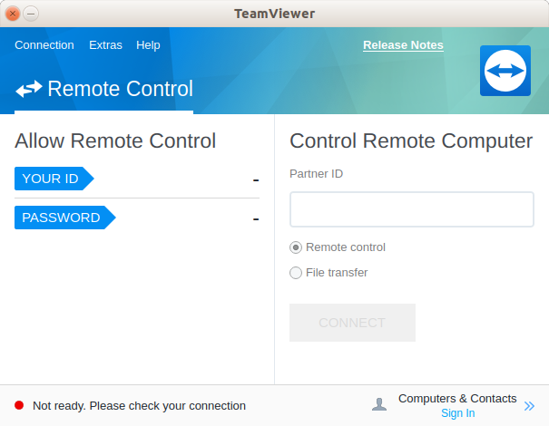

:date: 2018-10-02

========================
Tuesday, October 2, 2018
========================

TeamViewer says "Not Ready. Please check your connection"
=========================================================

And indeed it seems that teamviewer.com no longer exists::           

    $ ping teamviewer.com
    ping: teamviewer.com: Name or service not known

Excerpt from my :file:`TeamViewer13_Logfile.log`::

    2018/10/02 12:09:01.352  2707 140476560697088 S   Activating Router carrier
    2018/10/02 12:09:01.381  2707 140476569089792 S!!!CTcpConnectionBase[257]::HandleResolve(): Resolve failed, ping3.teamviewer.com, Error: asio.netdb:1
    2018/10/02 12:09:01.381  2707 140476569089792 S   Activating Router carrier
    2018/10/02 12:09:01.397  2707 140476560697088 S!! HttpRequestImpl::CurlFinished(): curl request failed: Couldn't resolve host name (6), Could not resolve host: ping3.teamviewer.com
    2018/10/02 12:09:01.397  2707 140476560697088 S!! Port443Connection::ConnectInternal: failed with HTTP status code = 0
    2018/10/02 12:09:01.397  2707 140476560697088 S!! NetWatchdog: Port 443 proxy search failed! No working setting found. -- 2 previous log entries omitted --
    2018/10/02 12:09:01.397  2707 140476560697088 S   Activating Router carrier
    2018/10/02 12:09:01.413  2707 140476434872064 S!! HttpRequestImpl::CurlFinished(): curl request failed: Couldn't resolve host name (6), Could not resolve host: ping3.teamviewer.com
    2018/10/02 12:09:01.414  2707 140476569089792 S!! NetWatchdog: Port 80 proxy search failed! No working setting found.
    2018/10/02 12:09:01.414  2707 140476569089792 S!  CKeepAliveClientClient::HandlePing(): ping failed
    2018/10/02 12:09:01.414  2707 140476569089792 S   Activating Router carrier
    2018/10/02 12:09:01.414  2707 140476569089792 S   CProcessCommandHandlerMasterConnect[260]::CreateMasterConnect(): master16.teamviewer.com:80, Connection 260, proxy=''
    2018/10/02 12:09:01.543  2707 140476434872064 S!! HttpRequestImpl::CurlFinished(): curl request failed: Couldn't resolve host name (6), Could not resolve host: master16.teamviewer.com
    2018/10/02 12:09:01.543  2707 140476527126272 S!  CProcessCommandHandlerMasterConnect[260]::HandleMasterConnect(): MasterConnect to 0.0.0.0 failed
    2018/10/02 12:09:01.549  2707 140476527126272 S!! LookUpDNS failed for master16.teamviewer.com, socket error = -2
    2018/10/02 12:09:01.549  2707 140476527126272 S!!!Connect to Master master16.teamviewer.com /  failed!
    2018/10/02 12:09:01.549  2707 140476527126272 S!! CMasterConnectorAsio::HandleMasterResponseLogin(): MasterConnect failed. ErrorCode=10

My problem is that neither Johanna in Eupen nor Hamza in Douz 
have the same problem.
So I guess it is a DNS issue.
Some DNS server between me and the teamviewer.com server giving some wrong information.
And indeed, after half an hour the problem vanished by itself.

