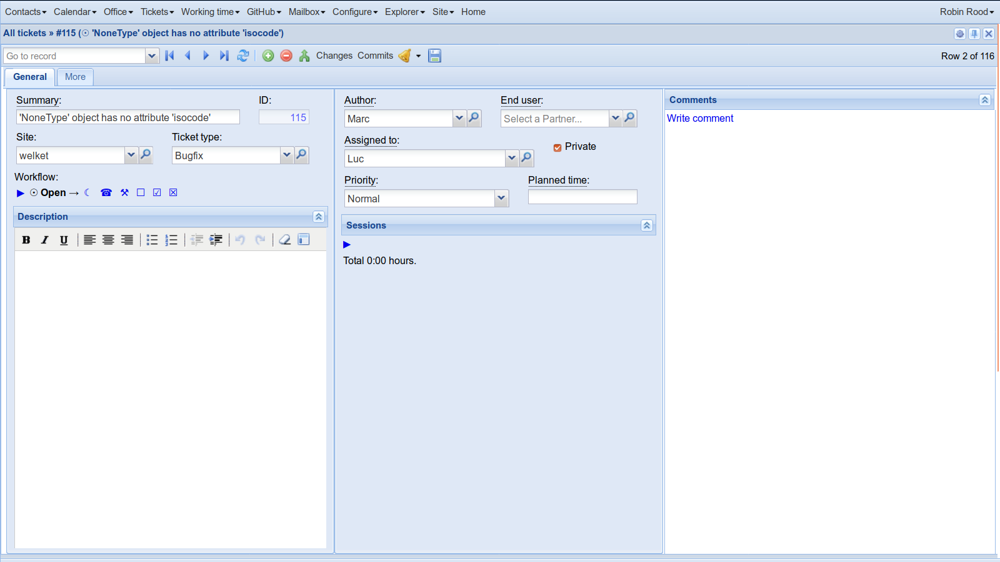

:date: 2018-12-06

==========================
Thursday, December 6, 2018
==========================

Tonis asked some information about the internals of  Lino.

We used a ticket detail as example.

The following snippets were tested using doctest docs/blog/2018/1206.rst

>>> from lino import startup
>>> startup("lino_book.projects.team.settings.demo")
>>> from lino.api.doctest import *
>>> # lh = rt.models.tickets.Tickets.actions['detail'].get_layout_handle()

A layout is the "uncompiled" representation of a window.

>>> dl = rt.models.tickets.Tickets.detail_layout
>>> rmu(dl.main)
'general more #history_tab #more2 #github.CommitsByTicket'

main is always a string. If it contains no newline, the layout will be rendered
in extui3 using a TabPanel, otherwise using a simple FormPanel.

main is a "descriptor", i.e. a space-separated list of names. Every name in a
descriptor must either match an attribute of the layout or a data element of
the underlying datasource.

If it matches an attribute of the layout, it can be either a string (i.e.
another descriptor of a data element or a group thereof) or a layout panel (an
instance of :class:`lino.core.layouts.Panel`, not to be mixed up with Panel
elements, see later).

In our example, :attr:`general` is a panel while :attr:`general1a` is just a
simple (multiline) string descriptor.

>>> p = dl.general
>>> p  #doctest: +ELLIPSIS
<lino.core.layouts.Panel object at ...>
>>> print(p.options)
{'label': u'General'}
>>> print(p.desc)
<BLANKLINE>
    general1:60 comments.CommentsByRFC:30
<BLANKLINE>

>>> print(dl.general1a)  #doctest: +NORMALIZE_WHITESPACE
<BLANKLINE>
    summary id:6
    site ticket_type
    workflow_buttons
    description
<BLANKLINE>

The "handle" of a layout has been factored from a given layout by the front-end
(extui3).

>>> lh = rt.models.tickets.Tickets.detail_layout.get_layout_handle()
>>> lh  #doctest: +ELLIPSIS
<lino.core.layouts.LayoutHandle object at ...>

>>> lh.main
<TabPanel main in lino_noi.lib.tickets.models.TicketDetail on lino_xl.lib.tickets.ui.Tickets>
>>> lh.main.elements
(<Panel general_1 in lino_noi.lib.tickets.models.TicketDetail on lino_xl.lib.tickets.ui.Tickets>, <Panel more in lino_noi.lib.tickets.models.TicketDetail on lino_xl.lib.tickets.ui.Tickets>)

Before continuing we must set a "current user type" because methods like
:meth:`lino.utils.jsgen.Companent.walk`
and :meth:`lino.utils.jsgen.Companent.find_by_name`
filter out elements for which the current user has no view
permission.

>>> from lino.modlib.users.utils import set_user_profile
>>> robin  = rt.login("robin").get_user()
>>> set_user_profile(robin.user_type)

>>> def show(k):
...     e = lh.main.find_by_name(k)
...     print("width: {}, preferred_width: {}".format(e.width, e.preferred_width))
>>> show("summary")
width: None, preferred_width: 21
>>> show("id")
width: 6, preferred_width: 5
>>> show("general1a")
width: 30, preferred_width: 60

Note that for the :attr:`general` layout attribute there is no element because
it becomes a panel:

>>> print(lh.main.find_by_name("general"))
None

Actually a panel *is* a special kind of element (a container) and *is* stored
in it's parent's elements attribute:

>>> lh.main.elements
(<Panel general_1 in lino_noi.lib.tickets.models.TicketDetail on lino_xl.lib.tickets.ui.Tickets>, <Panel more in lino_noi.lib.tickets.models.TicketDetail on lino_xl.lib.tickets.ui.Tickets>)

Let's have a look at the first tab panel:

>>> general_1 = lh.main.elements[0]

It has a label (all tab panels must have a label):

>>> print(general_1.get_label())
General

It contains two panels, one *normal* panel and one *slave summary* panel:

>>> general_1.elements
[<Panel general1_1 in lino_noi.lib.tickets.models.TicketDetail on lino_xl.lib.tickets.ui.Tickets>, <SlaveSummaryPanel comments_CommentsByRFC in lino_noi.lib.tickets.models.TicketDetail on lino_xl.lib.tickets.ui.Tickets>]

One field panel and one slave summary panel:

>>> pe = general_1.elements[0]

The "normal" panel contains itself again two subpanels

>>> len(pe.elements)
2
>>> pe = pe.elements[0]

Note that the __init__ of a Panel (element) has quite complex code to analyze
its elements and to set certain attributes.  This is quite extjs-focussed code.

>>> pe.vertical
True

>>> pe.vflex
True

>>> pe.width
30

>>> pe.preferred_width
60

>>> pe.height
>>> pe.preferred_height
10

>>> pe.value
{'hideCheckBoxLabels': True, u'layoutConfig': {'align': u'stretch'}, u'layout': u'vbox', 'flex': 50}

The value is adict with options. This is clearly for ExtJS-only (we should move
this from core to extui3... but that might be some work and might cause nasty
bugs). The value is used together with the value_template to generate JS code
for the ExtJS component:

>>> pe.value_template
u'new Ext.Panel(%s)'

In :mod:`lino.core.elems` you have code like this which updates the value::

        w = self.width or self.preferred_width
        kw.update(width=js_code("Lino.chars2width(%d)" % (w + 1)))

Hamza is working on :ref:`presto` and asked where we can define a price for a product.