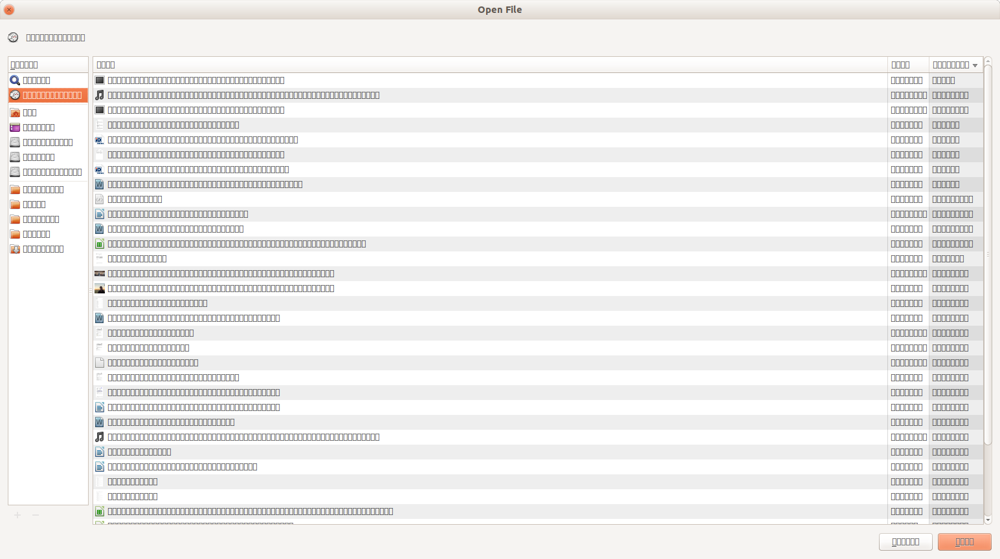

:date: 2019-07-29

=====================
Monday, July 29, 2019
=====================

Rediscovering Atom Editor
=========================

PyCharm uses so much power! Yesterday
I had to interrupt my work twice because my notebook was too hot.

I had another session with Atom.
In Atom I currently have a funny issue. The "Open File" dialog looks like this:

- https://discuss.atom.io/t/missing-font-for-dialog-box/48947
- https://discuss.atom.io/t/fixed-was-using-old-binaries-v1-20-1-fixed-it-messed-up-font-in-os-modal-windows-fedora-25/47896
- https://flight-manual.atom.io/getting-started/sections/installing-atom/#platform-linux

::

    $ wget -qO - https://packagecloud.io/AtomEditor/atom/gpgkey | sudo apt-key add -
    $ sudo sh -c 'echo "deb [arch=amd64] https://packagecloud.io/AtomEditor/atom/any/ any main" > /etc/apt/sources.list.d/atom.list'
    $ sudo apt-get install atom

Fixed. Yes, obviously I was using an obsolete version.

Before reasonably switching to Atom I also had to install the following packages:

    language-restructuredtext
    python-tools

Switching to Atom.

In my :xfile:`.bashrc` file::

  export EDITOR='atom'

But also in my :xfile:`.invoke.py` file::

    editor_command = 'atom'

Afterwards I removed above line and changed :ref:`atelier` so that the default
value for the :envvar:`editor_command` setting is now taken from the
:envvar:`EDITOR` environment variable.

One problem was that :cmd:`inv blog` did't  start the editor. Seems that atom
doesn't like the `pty=True`. The problem disappeared when I removed this
argument in :func:`atelier.invlib.edit_blog_entry`.

But when I ask :kbd:`Ctrl+Alt+G` (Goto definition) it says "python-tools could
not find any results!". Tried to install jedi.  Tried to set my virtualenv in
the package's settings. Then the problem vanished without explanation.

Cool: No need to find a plugin for reflowing a paragraph: :kbd:`Shift+Ctrl+Q`.
And, unlike the fill-paragraph in PyCharm it indents bullet lists (Paragraphs
starting with "- ") correctly.

But I prefer :kbd:`Alt+Q`. So I defined my first key binding: :kbd:`Cltr+,` to
open the settings, select Keybindings, search for "reflow", copy it to the
clipboard, pasted it to my  :xfile:`.atom/keymap.cson` and modified it to
`alt-q`. Attention pitfall: not `alt-Q`.

Testing getlino
===============
It is time to start testing getlino.
I added test a suite and a :xfile:`.travis.yml` file.

But I don't yet see how we can create virgin debian machines and then install
Lino on them. Dockerfiles? Heroku apps?

How to serialize choicelist
===========================

In a Django shell I can do:

>>> value = rt.models.tickets.TicketStates.new

::

  from lino.core.choicelists import Choice
  from django.db.migrations.serializer import BaseSerializer
  from django.db.migrations.writer import MigrationWriter

  class ChoiceSerializer(BaseSerializer):
      def serialize(self):
          return "rt.models.{}.{}.{}".format(value.choicelist.app_label, value.choicelist.__name__,value.name), {'from lino.api.shell import rt'}

  MigrationWriter.register_serializer(Decimal, DecimalSerializer)
