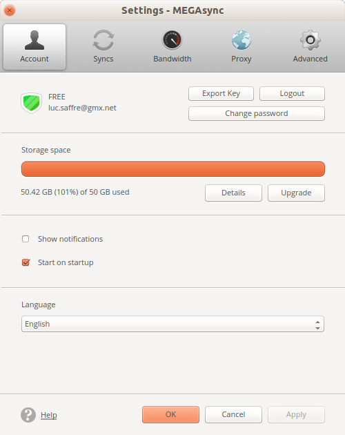

:date: 2019-07-30

======================
Tuesday, July 30, 2019
======================

Mega is nagging me
==================

When I exceed my quota, I cannot use the desktop client to remove some folder
because the Syncs tab is disabled.

Fortunately I can use the web interface and delete folders and then clear the
rubbish bin.

Testing getlino
===============

I am having inspiration about how to write a first docker test case. Playing
around in a virgin docker ubuntu container::

 $ docker run -it ubuntu

The first thing to do is to upgrade and to install basic stuff::

 # apt-get update
 # apt-get upgrade
 # apt-get install git python3-pip

Then install getlino (ATM I recommend the development snapshot)::

 # pip3 install -e git+https://github.com/lino-framework/getlino.git#egg=getlino

These operations take some time, and we probably want to create a free id on
docker hub and publish them.  But later.  First we continue playing::

  # getlino configure --batch

Oops, it says::

  RuntimeError: Click will abort further execution because Python 3 was
  configured to use ASCII as encoding for the environment. Consult
  https://click.palletsprojects.com/en/7.x/python3/ for mitigation steps.

So let's fix it::

  # locale -a
  C
  C.UTF-8
  POSIX

  # export LC_ALL=C.UTF-8
  # export LANG=C.UTF-8

This time it works!  And it stumbles into the first getlino bug::

  # getlino configure --batch
  This will write configuration file /root/.getlino.conf
  Wrote config file /root/.getlino.conf
  Traceback (most recent call last):
    File "/usr/local/bin/getlino", line 11, in <module>
      load_entry_point('getlino', 'console_scripts', 'getlino')()
    ...
    File "/src/getlino/getlino/configure.py", line 187, in configure
      i.write_file('/etc/monit/conf.d/lino.conf', MONIT_CONF)
    File "/src/getlino/getlino/utils.py", line 166, in write_file
      with open(pth, 'w') as fd:
  FileNotFoundError: [Errno 2] No such file or directory: '/etc/monit/conf.d/lino.conf'

The bug is probably trivial: it tries to write the monit conf file before monit
is installed. Note that you won't be able to reproduce above situation since the
bug has been fixed meanwhile (see below).

Important : I am not going to fix that bug now. I am going to write a test suite
which finds that bug.  IOW I want to see above bug on travis.

How about creating a free id on docker hub and publish a getlino image? But
wait.  Let's now look at Hamza's :xfile:`Dockerfile` in the getlino repo. Aha,
it is not based on ``ubuntu`` but on ``python:3.7``. Seems a good idea. Let's
try interactively::

  $ docker run -it python:3.7
  Python 3.7.4 (default, Jul 13 2019, 14:04:11)
  [GCC 8.3.0] on linux
  Type "help", "copyright", "credits" or "license" for more information.
  >>>

Oh no, this image starts into a Python shell. And when I hit :kbd:`Ctrl+D` the
container terminates. We need a bash.

But wait, we can say this when starting the container::

  $ docker run -it python:3.7 bash

Now I can work::

  # pip3 install -e git+https://github.com/lino-framework/getlino.git#egg=getlino
  # getlino configure --batch

Voilà. That's what we want to automate! I adapted Hamza's :xfile:`Dockerfile`.
It was doing some useless things (like creating a workdir and copying some
files), but I see that he found how to create a non-root user.  That's good.

After editing the :xfile:`Dockerfile` I must build an image from it before I can
run it.  The following is again on my machine::

  $ go getlino
  $ docker build -t getlino .

After getting this to produce my traceback, it's time to automate it (the
following is in new file :file:`tests/test_docker_prod.py`)::

  from os.path import dirname, join
  from atelier.test import TestCase
  import getlino

  class DockerTests(TestCase):
      def test_01(self):
          args = ['docker', 'build', '-t', 'getlino', join(dirname(getlino.__file__), '..')]
          self.run_subprocess(args)

So now when I run :cmd:`inv test` in my getlino project dir, I get the traceback.
Commit and see whether :ref:`travis` agrees.
Several more commits to fix a few trivial issues.

And yess! I get the error on travis:
https://travis-ci.org/lino-framework/getlino/jobs/565318097

I also started moving the getlino docs from the one-page `book/docs/getlino.rst`
file to an independent doctree, which is published at
http://getlino.lino-framework.org/

Next step was to fix the bug : my first guess is in file
:file:`getlino/configure.py` in commit `bf672b79
<https://github.com/lino-framework/getlino/commit/bf672b79068527843c9de3eb892bcd008eee65dc>`__`)).

But that doesn't seem to be enough. Seems that ``monit`` does not create a
directory :file:`/etc/monit/conf.d` in that setup.

Accounting
==========

I found a bit of time to continue entering our purchase invoices into our own
:ref:`cosi` site.

Before starting I did a release on our site in order to test the latest changes
(e.g. Partner detail, :ticket:`2986`, ...).  Took me some time to realize why
the partner detail didn't become active: our :xfile:`pull.sh` was pulling cosi,
but our :xfile:`env` actually used the PyPI version. (TODO: :xfile:`pull.sh`
should verify whether the repository being pulled is the same as the one being
used in the env).

When the worker pays the invoice
================================

I did :ticket:`3106`.
Added a new field :attr:`lino_xl.lib.accounting.PaymentTerm.worker`.
Added a new site setting :attr:`worker_model <lino_xl.lib.accounting.Plugin.worker_model>`
Changed the code in :meth:`lino_x.lib.mixins.Payable.get_wanted_movements`.

Adapted the demo fixtures.  The new feature is visible only in
:mod:`lino_book.projects.apc`. Wrote documentation and doctest in
:ref:`internal_clearings`.
