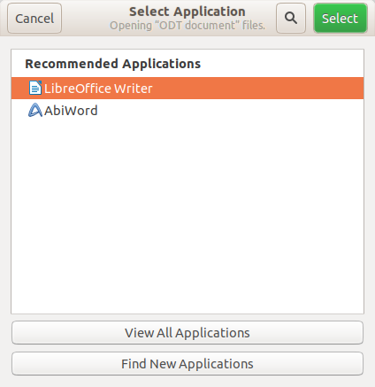

:date: 2019-08-07

=========================
Wednesday, August 7, 2019
=========================

I fixed some failures of the book test suite. Which revealed a bug:
:attr:`use_linod <lino.core.site.Site.use_linod>` did not yet automatically
cause :manage:`install` to install the `schedule` package.

SSH key already expired
=======================

Strange: Enigmail says "Your key "Luc Saffre <luc.saffre@gmx.net>" (key ID AA08
9AA7 687C 65B4 ECB5 A1C5 4B7A AFD7 85BA 6D05) will expire in less than 30 days.
We recommend that you create a new key pair and configure the corresponding
accounts to use it."

Ubuntu Files manager fails to open files
========================================

When I double click or type ENTER on a file in Files (the default file manager
in Ubuntu, aka Nautilus), it seems to run some process (the mouse cursor becomes
a hourglass for some time), but actually nothing opens. When I do the same in
Thunar (another file manager), it works fine.

The problem occurs with all file extensions (pdf, png, odt, doc, ...)

It *does* open files when I right-click and select "Open with other
application", and then press ENTER to select the default application.

ENTER in above dialog will launch LibreOffice writer correctly. But does it fail
when I just hit ENTER on the file?

I went to :menuselection:`Files --> Preferences --> Behaviour` and changed "Open
Action" from "Double click to open items" to "Single click to open items".  Now
a single click toggles the open action, but the problem remains the same.

After reading `this article
<https://itsfoss.com/install-nemo-file-manager-ubuntu/>`__, I switched from
Nautilus to Nemo::

  $ xdg-mime default nemo.desktop inode/directory application/x-gnome-saved-search
  $ gsettings set org.gnome.desktop.background show-desktop-icons false
  $ gsettings set org.nemo.desktop show-desktop-icons true

Note that I had Nemo already installed earlier.

It's strange that both Nemo and Nautilus are named "Files"...
