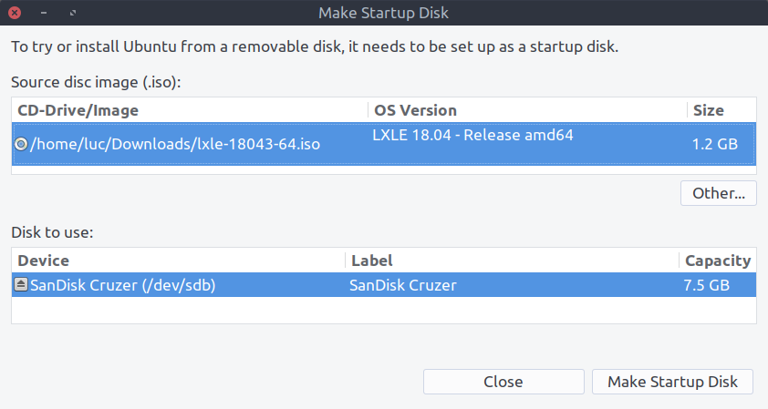

:date: 2019-11-28

===========================
Thursday, November 28, 2019
===========================

Running Linux on an older PC
============================

Ticket :ticket:`3357` is not directly related to Lino.  I am installing LXLE on
Ly's old notebook computer in order to make it quick again so that Iiris can use
it. It had become unbearably slow because it has only 2 GB of RAM, and Ubuntu is
simply too fat for this old machine.  Quote from a discussion on `linux.org
<https://www.linux.org/threads/how-much-ram.19181/>`_ :  "IMO to have an
enjoyable 1st experience using Ubuntu 18.04 LTS or any Linux I would highly
recommend at least 4.0 GB of memory. From my experience trying to run Ubuntu
18.04 LTS with only 2.0 GB memory will be painful at best."

`LXLE
<https://lxle.net/about/>`_ is a "Full featured OS for an aging PC" based on
Lubuntu. I chose it after reading `10 Best Lightweight Linux Distributions For
Older Computers <https://itsfoss.com/lightweight-linux-beginners/>`_.

I downloaded an ISO image from https://sourceforge.net/projects/lxle/

How to get the ISO file to an USB stick? `This article
<https://fossbytes.com/create-bootable-usb-media-from-iso-ubuntu/>`__ suggests
that that Startup Disk Creator can do it.  I had to install python3-coverage
before getting it installed::

  $ sudo apt-get install python3-coverage
  $ sudo apt install usb-creator-gtk

Before it actually starts writing, it asks "Are you sure you want to write to
the selected device? All data will be lost."  The operation then takes a few
minutes. At the end it says "Installation is complete.  You may now run Ubuntu
on other computers by booting them with this drive inserted."

I manually unmounted the USB stick before removing it.

Another article suggests to simply use :cmd:`dd`:
https://vitux.com/how-to-create-a-bootable-usb-stick-from-the-ubuntu-terminal/

Lino gets ready for Django 3.0
==============================

It's already 10 days ago that they released `Django 3.0 release candidate 1
<https://www.djangoproject.com/weblog/2019/nov/18/django-30-release-candidate-1-released/>`__.
Now I did :cmd:`pip install --pre -U django` and ran the test suite. I opened
:ticket:`3360` for this.

- "TypeError: not all arguments converted during string formatting" in
  :mod:`lino` when parsing the Django version.  Now Lino will work also with
  Django 4+.

- ImportError: cannot import name 'python_2_unicode_compatible' : so I removed
  this decorator from everywhere (several hundred occurrences in more than a
  dozen repositories!)

- Replaced "from django.utils import six" by "import six".  Started replacing
  :func:`six.text_type` by :func:`str` Soon we might also remove all usage of
  six, but that's not a blocker.

- TypeError: 'NoneType' object is not iterable : seems that
  :attr:`Field.choices` can now be `None`. Okay, why not.

- TypeError: from_db_value() missing 1 required positional argument: 'context' :

  That was because we have several Lino fields that define a
  :meth:`from_db_value` method::

    def from_db_value(self, value, expression, connection, context):

  And the `Release notes
  <https://docs.djangoproject.com/en/dev/releases/3.0/>`__ say clearly that
  "Support for the context argument of Field.from_db_value() and
  Expression.convert_value() is removed."

  So I changed the signature of these methods so that they support both Django 2
  and 3::

    def from_db_value(self, value, expression, connection, context=None):

- django.core.exceptions.ValidationError: {'choicelist': ["Value 'properties.HowWell' is not a valid choice."]}

  The :mod:`lino_xl.lib.properties` plugin is rather deprecated but still used
  in :ref:`welfare`.

  I moved the choicelists into a separate :xfile:`choicelists.py` module because
  I had a feeling that maybe that triggers the problem. Nope. But I leave them
  in a separate module.

  So what then is happening there? Aha, look at the `PropType.choicelist` field.
  It is defined as follows::

    choicelist = models.CharField(
        max_length=50, blank=True,
        verbose_name=_("Choices List"),
        choices=choicelist_choices())

  The :func:`lino.core.kernel.choicelist_choices` function  returns a sorted
  list of all choicelists in this application.  But: this list is not yet
  populated when the modules.py modules are being imported.  So the return value
  is always empty. Also in Django 2 this field does not have any choices.
  Django 3 detected a bug in our code that had gone unnoticed in Django 2 :-)

  The solution is to use a chooser, i.e. a choicelist_choices method. Now it
  works at least in Django 2.

- All primary keys had sums in doctests. Lino assumes that the sum of a primary
  key makes no sense and therefore it is automatically hidden.  This logic lives
  in the :class:`lino.core.elems.AutoFieldElement` class where we say::

    class AutoFieldElement(NumberFieldElement):

        def value2num(self, v):
            return 0

  The :func:`lino.core.elems.field2elem` works by looping over a list of Django
  database field classes and finds the first element class found for the
  database field. One thing that's new in Django 3 : AutoField now inherits from
  IntegerField.  That makes sense, but it caused Lino to return an
  IntegerFieldelement for AutoField as well.  The solution was easy: simply test
  for AutoField before testing for IntegerField.
