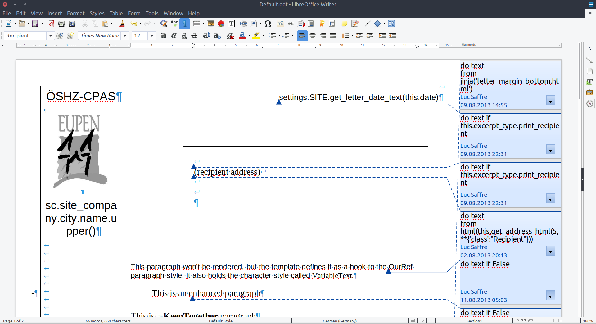

:date: 2020-07-21

======================
Tuesday, July 21, 2020
======================

The getlino test suite failing
==============================

The getlino test suite gets stuck at  :cmd:`getlino configure --batch --monit`::

  ===== run in <Container: dad19689e7> : . /usr/local/lino/shared/env/master/bin/activate && sudo getlino configure --batch --monit =====

  No output has been received in the last 10m0s, this potentially indicates a
  stalled build or something wrong with the build itself.

How can I see the output of that command during these 10 minutes?

Here is the code that runs the command::

  def run_docker_command(self, command):
      print("===== run in {} : {} =====".format(self.container, command))
      assert not "'" in command
      exit_code, output = self.container.exec_run(
          """bash -c '{}'""".format(command), user='lino', stdin=True, tty=True)
      output = output.decode('utf-8')
      if exit_code != 0:
          msg = "%s  returned %d:\n-----\n%s\n-----" % (
              command, exit_code, output)
          self.fail(msg)
      else:
          return output

I added these `stdin=True, tty=True` some days ago but they obviously don't
help.

I tried the following: I run :cmd:`inv test` in getlino on my machine, and when
it is hanging, I look at the last line because it gives me the container id::

  ===== run in <Container: b65722b0bb> : . /usr/local/lino/shared/env/master/bin/activate && sudo env PATH=$PATH getlino configure --batch --monit =====

Now I can access that container from another terminal and try to find out what's
happening.  For example::

  $ docker exec -it b65722b0bb ps aux
  USER       PID %CPU %MEM    VSZ   RSS TTY      STAT START   TIME COMMAND
  lino         1  0.0  0.0  20252  3636 pts/0    Ss+  11:17   0:00 /bin/bash
  root        70  0.0  0.0  49448  3940 pts/1    Ss+  11:17   0:00 sudo env PATH=/usr/local/lino/shared/env/master/bin:/usr/local/sbin:/usr/local/bin:/usr/sbin:/usr/bin:/sbin:/
  root        78  0.0  0.3  86580 28028 pts/1    S+   11:17   0:00 /usr/local/lino/shared/env/master/bin/python /usr/local/lino/shared/env/master/bin/getlino configure --batch
  mysql     6644  0.0  0.0   4624  1768 ?        S    11:21   0:00 /bin/sh /usr/bin/mysqld_safe
  mysql     6994  0.1  2.2 1424296 181728 ?      Sl   11:21   0:07 /usr/sbin/mysqld --basedir=/usr --datadir=/var/lib/mysql --plugin-dir=/usr/lib/mysql/plugin --log-error=/var/
  root      7070  0.0  0.0 141116  1556 ?        Ss   11:21   0:00 nginx: master process /usr/sbin/nginx
  www-data  7071  0.0  0.0 141492  3556 ?        S    11:21   0:00 nginx: worker process
  www-data  7072  0.0  0.0 141492  3556 ?        S    11:21   0:00 nginx: worker process
  root      7074  0.0  0.0   4624   860 pts/1    S+   11:21   0:00 /bin/sh -c mysql_secure_installation
  root      7075  0.0  0.0  33964  6592 pts/1    S+   11:21   0:00 mysql_secure_installation
  lino      7087  0.0  0.0  36148  3140 pts/2    Rs+  13:06   0:00 ps aux

Here are the explanation of the STAT codes (taken from ``man ps``)::

   S    interruptible sleep (waiting for an event to complete)
   s    is a session leader
   l    is multi-threaded (using CLONE_THREAD, like NPTL pthreads do)
   +    is in the foreground process group
   R    running or runnable (on run queue)

I then discovered how to run an interactive session in my docker container::

  $ docker build -t getlino_debian -f Dockerfiles/debian .
  $ docker run -it --name mycont getlino_debian /bin/bash

Hitting :kbd:`Ctrl-D`

  $ docker rm --force mycont

..

  $ docker run --publish 8000:8080 --detach --name mycont getlino_debian

I think we need multi-stage builds. I plan to review our docker strategy and started reading
https://blog.bitsrc.io/a-guide-to-docker-multi-stage-builds-206e8f31aeb8

But that will take more time. To be continued.

"Distutils was imported before Setuptools"
==========================================

My yesterday changes didn't fix the issue that something is still causing the
following warnings::

  UserWarning: Distutils was imported before Setuptools. This usage is discouraged and may exhibit undesirable behaviors or errors. Please use Setuptools' objects directly or at least import Setuptools first.

After reading `this
<https://github.com/microsoft/vscode-python/issues/12949>`__, I changed the
:xfile:`.travis.yml` file of presto (where the problem also occurred) to request
setuptools before 49.2::

  install:
    - pip install -U "setuptools<49.2"

This fixed the problem. So it seems that `the latest change in setuptools 49.2
<https://setuptools.readthedocs.io/en/latest/history.html>`__ ("Now warn the
user when setuptools is imported after distutils modules have been loaded
(exempting PyPy for 3.6), directing the users of packages to import setuptools
first.") somehow causes the problem.  It's a problem for me because it causes
our doctests to fail.  And because I don't see how to get rid of this warning. I
don't import distutils myself.

I saw it also locally on my machine, even with a simple runserver in min1. So I
reported this to Django as well: https://code.djangoproject.com/ticket/31808
(but that ticket turned out to be invalid: a plain virgin django project does
not have the problem, so it must be one of our dependencies)

"No local config directory. Contact your system administrator."
===============================================================

The welfare test run on :ref:`travis` is `failing
<https://travis-ci.org/github/lino-framework/welfare/jobs/710248248>`__
in :file:`docs/specs/welcht/misc.rst` with above message.

This is caused by my recent changes in the config dirs. Let's see whether it
helps when I deactivate :envvar:`LINO_CACHE_ROOT` for this test.

This is now causing a `django.db.utils.OperationalError: no such table:
users_user
<https://travis-ci.org/github/lino-framework/welfare/jobs/710260192>`__. I guess
that's because my trick of deactivating :envvar:`LINO_CACHE_ROOT` makes the
doctest use another directory where prep hasn't run. This trick works only when
I don't access the database in my doctest. So I need to imagine another
solution.

More manual testing on the weleup preview
=========================================

I added a call to :manage:`checkdata` in the :xfile:`initdb_from_prod.sh` on
weleup.  I still see no confirmation that checkdata has ever run on their prod
site. It should run every evening at 20:00, but there are no log entries. On the
preview it has run and logged yesterday evening. Their prod site has only 5
checkdata messages (actually there are thousands of them).

AttributeError: 'NoneType' object has no attribute 'has_auto_events'
====================================================================

Lino failed to show the detail of a calendar entry with an auto_type but no
owner (which is a checkdata problem because this case doesn't occur
theoretically). The traceback was clear: AttributeError: 'NoneType' object has
no attribute 'has_auto_events'

The problem was in :mod:`lino_xl.lib.cal`. I fixed it but didn't yet add an
automated test case.

I tested manually by setting the auto_type field of a manually created calendar
entry to a non-empty value.  To edit that field which is not shown in the detail
window, I go to :menuselection:`Explorer --> Calendar Entries` and add the column
labelled "Nr.".

Editing the field caused another AttributeError "'NoneType' object has no
attribute 'update_cal_summary'" for a similar reason.

Code changes: Fixed two exceptions caused by a calendar entry with an
:attr:`auto_type` but no :attr:`owner` (which is a checkdata problem because
this case doesn't occur theoretically). The checkdata message "Has auto_type but
no owner." is now fixable, it fixes the problem by setting the auto_type to None
in that case.

Auszüge vergleichen
===================

Bescheinigung EiEi : hier steht im Adressfeld jetzt "(no recipient address)"
(wenn die Bescheinigung keinen Empfänger hat), und unterm Namen sind
irgendwelche Logos.

Here is a run script I used to localize the problem::

  from lino.api.shell import *
  this = rt.models.excerpts.Excerpt.objects.get(pk=28109)
  print(this.get_address_html(5, **{'class':"Recipient"}))

The reason was a changed behaviour in appy in when you have both a ``do text
from`` and a ``do text if`` comment in a same paragraph::

  do text
  from html(this.get_address_html(5, **{'class':"Recipient"}))

  do text if this.excerpt_type.print_recipient

Here is how I explained it to Gaetan:

  Je viens d'observer une différence subtile entre la nouvelle version de appy et
  la vielle version. Dans un template du CPAS j'ai un paragraphe encadré qui
  contient un texte "(recipient address)". Voir image. Ce texte sera effacé car le
  paragraphe contient aussi un commentaire "do text from". Jusqu'ici pas de
  différence. Mais dans ce meme paragraphe il y a encore un deuxième commentaire
  "do text if". Dans la nouvelle version appy, j'ai du déplacer l'ancre de
  commentaire avant mon text "(recipient address") car sinon ce texte n'était pas
  écrasé.

Ismail getting started
======================

Ismail reported a problem installing :ref:`noi`, and I guess that it's just
because noi hasn't been released to pypi for a while.

Oho, while trying to reproduce his problem I realized that etgen depends on
atelier.  Because of ``atelier.rstgen``. Maybe move ``rstgen`` from `atelier` to
`etgen`, and make `atelier` depend on it? No, that would create a circular
dependence.  But wait, I can simply move ``atelier.rstgen`` into a spearate
package named ``rstgen``.  That name is still available on PyPI.

All in all it was easier than I feared: I declared the new package :mod:`rstgen`
on PyPI: https://pypi.org/project/rstgen/20.7.0/

How to test whether the README.rst file of a new package contains syntax
errors::

  $ rst2html.py --strict README.rst

I updated the :ref:`dev.overview` page of the book.
