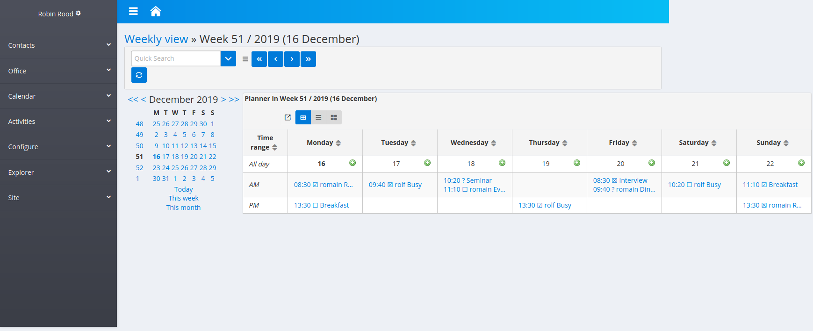
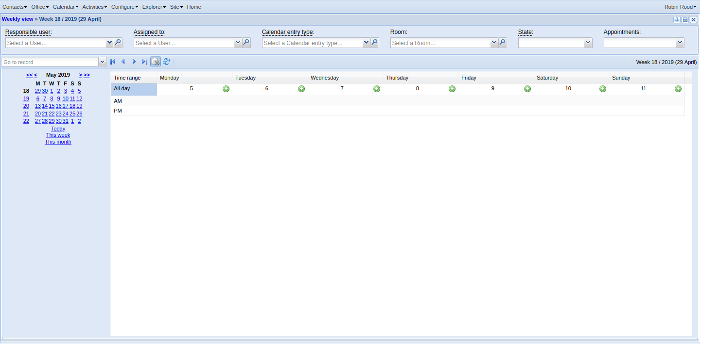

:date: 2020-08-28

=======================
Friday, August 28, 2020
=======================

I worked on :ticket:`3769`.

How to reproduce: go amici1; runserver; sign in as robin. The dashboard says "We
are running with simulated date set to Monday, 16 December 2019." Select
:menuselection:`Calendar --> Calendar`.

Week navigation causes calendar to mess up weeks:

- Initial view is correct: http://127.0.0.1:8000/#/api/calview/WeeklyView/0

- In the navigation_panel, hover to the "50" for the previous week. It links
  to the following URL::

    javascript:window.App.runAction({ "actorId": "calview.WeeklyView", "an":
    "detail", "onMain": true, "rp": "weak-key-17", "sr": -1, "status": {
    "base_params": {  }, "param_values": { "assigned_to": null,
    "assigned_toHidden": null, "event_type": null, "event_typeHidden": null,
    "room": null, "roomHidden": null, "show_appointments": null,
    "show_appointmentsHidden": null, "state": null, "stateHidden": null, "user":
    null, "userHidden": null }, "record_id": -1 } })

  Yes, there was a bug in the
  :attr:`lino_xl.lib.calview.CalendarView.navigation_panel` virtual field.

The slave title says "None in Week 50 / 2019 (09 December)":

It is about :class:`calview.WeeklySlave <lino_xl.lib.calview.WeeklySlave>`. We explicitly say::

  @classmethod
  def get_actor_label(self): return None

Having both label and title of an actor None should hide the panel's header
altogether. I think that I implemented this new rule in extjs and not yet in
react. But I didn't yet find it in extjs...

As a workaround, I now say ``title = _("Planner")`` in
:class:`calview.WeeklySlave <lino_xl.lib.calview.WeeklySlave>`. and the slave
title now says "Planner in Week 50 / 2019 (09 December)". Seems to look okay
in both front ends.

But in extjs the title continues to be hidden. TODO:
explain why and make the behaviours consistent.

We had a session with Tonis and explored the problem of the column sizing. It
has to do with a kind of "threshold" where react decides that "there is not
enough horizontal space, so I give up to try to fit the table into the screen".
That threshold is a good thing, but it seems to be set too low here. In the
Organizations table it works reasonably well.
