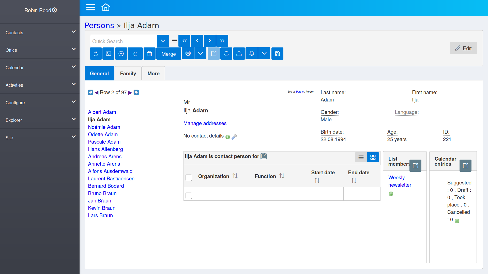
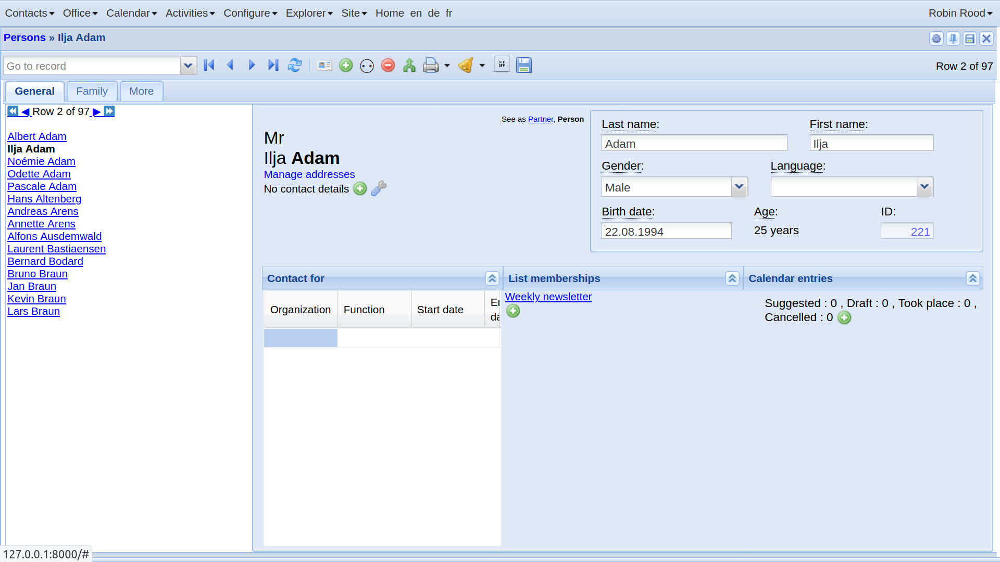

:date: 2021-03-25

========================
Thursday, March 25, 2021
========================

I wrote a section :ref:`dev.actors.react`. But most of these options are
"deprecated" and should be replaced by something else. I reviewed more passages
in :ref:`dev.format`.

A generic navigation panel for table views
==============================================

Charles asked for a layout where you have a list view for navigating over your
rows in a panel on the left, but otherwise a detail view. I wanted to know it
and and finished up with a new generic virtual field
:attr:`navigation_panel <lino.core.model.Model.navigation_panel>`.  A first use case is the
`PersonDetail` in :ref:`amici`.  Here is the source code::

  class PersonDetail(PersonDetail):

      main = "general family more"

      general = dd.Panel("navigation_panel:20 general_box:60", label=_("General"))

      general_box = """
      overview contact_box
      contacts.RolesByPerson:30 lists.MembersByPartner:30 cal.EntriesByGuest:30
      """

      ...

And the result:

A nice new feature. Thanks to Charles for the request. Yes, we should have a
look at the cosmetic aspects.  I used quite a few dirty hacks to get a decent
look. And then we probably want to hide away the navigation buttons from the
toolbar when we have such a panel. One disadvantage is that you cannot navigate
when you have activated the second or third tab panel.

While working on this, I discovered and fixed a rather invisible bug:
:func:`lino.core.fields.wildcard_data_elems` was returning *all* virtual fields.
The official behaviour is that virtual fields are not returned unless they are
defined with :attr:`lino.core.fields.VirtualField.wildcard_field` set to `True`.
This rule is for performance reasons. Some virtual fields a rather heavy (e.g.
the :attr:`navigation_panel <lino.core.model.Model.navigation_panel>` must query
the whole database to get all primary keys), and even when they are hidden, Lino
has to include :term:`wildcard fields <wildcard field>` in the result because
the end user might have enabled them. It was a bit stupid to compute the
navigation panel for each row of a grid.

>>> from lino import startup
>>> startup('lino_amici.projects.amici1.settings')
>>> from lino.api.doctest import *
>>> # [f.name for f in rt.models.contacts.Person._meta.private_fields]
>>> [f.name for f in rt.models.contacts.Persons.wildcard_data_elems()]

I reviewed the :ref:`lino.tutorial.tables` page, which contained some obsolete
bullshit (using a :xfile:`desktop.py` module is obsolete).  And it did not
explain what are wildcard fields. Renamed "table" to "table views".
