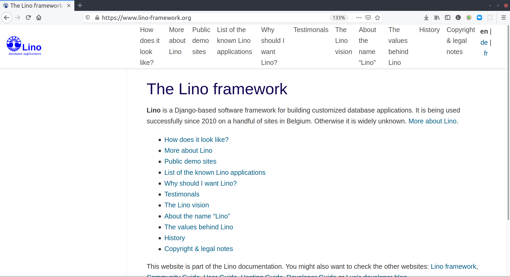

:date: 2021-05-18

=====================
Tuesday, May 18, 2021
=====================

The docs are ugly on a desktop screen because the pydata theme tries to display
the top-level menu items in the top navigation bar.

pydata-theme works only well when the top-level page titles are very short. I
read `the docs
<https://pydata-sphinx-theme.readthedocs.io/en/latest/user_guide/sections.html>`__
and played around in both theme configurations, but finally repented back to the
insipid theme.

Sustainability of OSS Communities
=================================

I attended to an online webinar organized by OSOR about their document
"Guidelines for Sustainable Open Source Communities in the Public Sector".

Have a look at Joinup to discover the OSOR resources:

 https://joinup.ec.europa.eu/collection/open-source-observatory-osor/knowledge-centre

The Guidelines for creating sustainable open source communities are accessible here:

 https://joinup.ec.europa.eu/collection/open-source-observatory-osor/guidelines-creating-sustainable-open-source-communities

The document is based on five case studies:

- CONSUL platform for participatory democracy developed in in Groningen.
- Integreat. New arrivals' integration in Germany.
- Developers Italia, an online platform to discuss ongoing or future
  projects.
- Lutece in France. A CMS developed and maintained by City of Paris.
- OSKARI framework for integrating geospatial data into web sites.

Chloé Dussutour (OSOR Team) asked us to share our experience with them by
providing feedback on the Guidelines:

  https://joinup.ec.europa.eu/collection/open-source-observatory-osor/news/we-want-hear-your-feedback-sustainability-guidelines

I said that I am surprised that the FSFE and its `Public Money Public Code
<https://publiccode.eu/>`__ campaign is not mentioned in the Guidelines. Answer:
PMPC has a clear political direction, while the OSOR is a public administration
and as such must remain neutral.

Which does not mean that there is no communication. For example here is a FOSDEM
2021 interview  by Alexander Sander (FSFE) and Evangelos Tsavalopoulos about the
European Commission Open Source Strategy:

  https://www.youtube.com/watch?v=UB9Wga-AaHk

The FSFE is pleased that the EU Commission's Open Source Strategy "recognises
the benefits of Free Software and the four freedoms to use, study, share and
improve", but in the same sentence adds that "the Commission lacks concrete
targets and indicators to implement the strategy." (`source
<https://fsfe.org/news/2020/news-20201023-01.html>`__).

EU Commissioner Johannes Hahn published a clear political statement on 'Public
Money? Public Code!':

  https://www.youtube.com/watch?v=h3SK96jLTSU

During the meeting I also wrote the following to the Jitsi chat of the event:

  Thanks for this event.
  I would like to launch a call for help here.  I enrolled
  to this webinar in the hope of finding my future boss. I am currently the CEO of
  a family-owned company in Estonia. We work sustainably with a dozen of
  customers, two developers and one system administrator. Our biggest customers
  are three local public administrations in Belgium. We believe that Lino would be
  useful for many other organizations.  We did the legal steps to publish it as
  Free Software under the AGPL. But I am a software developer, not a manager.  My
  vocation is to write Lino, not to build up a clear governance for its community.

  - https://www.lino-framework.org/vision.html
  - https://www.lino-framework.org/framework.html

  If you feel that you should contact me, please don't hesitate.
  https://www.saffre-rumma.net/team/luc/

..
  I assume that besides me there are not many developers here. I mean people
  who actually write code.
