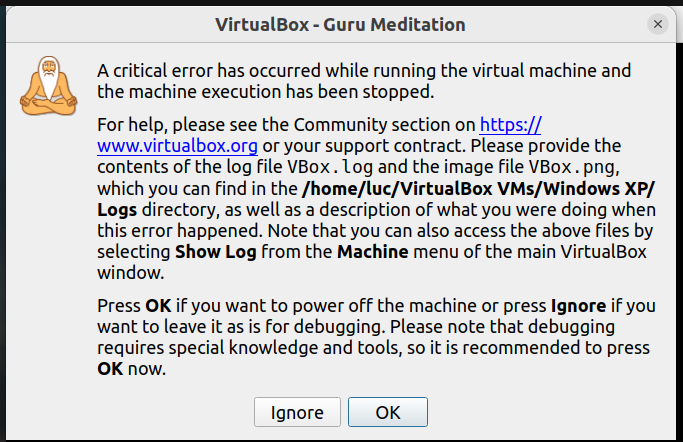

:date: 2024-08-21

==========================
Wednesday, August 21, 2024
==========================

Today I wanted to see a balance from my accounting system, which has been
running stable as a rock for the last 20 years.

I use TIM for my accounting. TIM has one disadvantage: it runs only under
Windows. That's why I still have a copy of the Windows XP from my last Windows
computer, which I run in a VirtualBox VM without Internet connection.

But that box didn't open today. It said:

On https://forums.virtualbox.org/viewtopic.php?t=111917 I found the probable
explanation: I am still using VB version 6.1, which came to its end of life in
December 2023. "If you've applied a recent Linux kernel upgrade then roll back
to the previous working kernel. VirtualBox 6.1.50 is out of date and no longer
supported; so running newer Linux kernels is likely to result in problems if
VirtualBox is not upgraded."

Thanks to concise upgrade instructions on `kifarunix.com
<https://kifarunix.com/upgrade-virtualbox-6-x-to-virtualbox-7-x-on-ubuntu-debian/?expand_article=1#google_vignette>`__
it took me only half an hour to get it running again. The remaining part of this
post are just my console sessions.

I don't have the `VirtualBox Extension Pack
<https://redresscompliance.com/virtualbox-extension-pack-advanced-features-and-licensing/>`__::

  $ sudo vboxmanage list extpacks
  Extension Packs: 1
  Pack no. 0:   VNC
  Version:      6.1.50
  Revision:     161033
  Edition:
  Description:  VNC plugin module
  VRDE Module:  VBoxVNC
  Usable:       true
  Why unusable:

Uninstall the old version::

  $ sudo apt remove --purge --auto-remove virtualbox virtualbox-6.1
  Reading package lists... Done
  Building dependency tree... Done
  Reading state information... Done
  Package 'virtualbox-6.1' is not installed, so not removed
  The following packages will be REMOVED:
    dctrl-tools* dkms* libcairo-5c0* libgsoap-2.8.117* linux-headers-6.2.0-39-generic* linux-hwe-6.2-headers-6.2.0-39* python-tinycss2-common* python3-cairocffi*
    python3-cairosvg* python3-cffi* python3-cssselect2* python3-defusedxml* python3-ply* python3-pycparser* python3-tinycss2* python3-xcffib* virtualbox*
    virtualbox-dkms* virtualbox-qt*
  0 upgraded, 0 newly installed, 19 to remove and 6 not upgraded.
  After this operation, 293 MB disk space will be freed.
  Do you want to continue? [Y/n]
  (Reading database ... 312295 files and directories currently installed.)
  Removing virtualbox-qt (6.1.50-dfsg-1~ubuntu1.22.04.3) ...
  Removing virtualbox (6.1.50-dfsg-1~ubuntu1.22.04.3) ...
  Removing virtualbox-dkms (6.1.50-dfsg-1~ubuntu1.22.04.3) ...
  Module virtualbox-6.1.50 for kernel 6.5.0-45-generic (x86_64).
  Before uninstall, this module version was ACTIVE on this kernel.

  vboxdrv.ko:
   - Uninstallation
     - Deleting from: /lib/modules/6.5.0-45-generic/updates/dkms/
   - Original module
     - No original module was found for this module on this kernel.
     - Use the dkms install command to reinstall any previous module version.

  vboxnetadp.ko:
   - Uninstallation
     - Deleting from: /lib/modules/6.5.0-45-generic/updates/dkms/
   - Original module
     - No original module was found for this module on this kernel.
     - Use the dkms install command to reinstall any previous module version.

  vboxnetflt.ko:
   - Uninstallation
     - Deleting from: /lib/modules/6.5.0-45-generic/updates/dkms/
   - Original module
     - No original module was found for this module on this kernel.
     - Use the dkms install command to reinstall any previous module version.

  depmod...
  Module virtualbox-6.1.50 for kernel 6.8.0-40-generic (x86_64).
  Before uninstall, this module version was ACTIVE on this kernel.

  vboxdrv.ko:
   - Uninstallation
     - Deleting from: /lib/modules/6.8.0-40-generic/updates/dkms/
   - Original module
     - No original module was found for this module on this kernel.
     - Use the dkms install command to reinstall any previous module version.

  vboxnetadp.ko:
   - Uninstallation
     - Deleting from: /lib/modules/6.8.0-40-generic/updates/dkms/
   - Original module
     - No original module was found for this module on this kernel.
     - Use the dkms install command to reinstall any previous module version.

  vboxnetflt.ko:
   - Uninstallation
     - Deleting from: /lib/modules/6.8.0-40-generic/updates/dkms/
   - Original module
     - No original module was found for this module on this kernel.
     - Use the dkms install command to reinstall any previous module version.

  depmod...
  Deleting module virtualbox-6.1.50 completely from the DKMS tree.
  Removing dkms (2.8.7-2ubuntu2.2) ...
  Removing dctrl-tools (2.24-3build2) ...
  Removing libcairo-5c0:amd64 (1.21) ...
  Removing libgsoap-2.8.117:amd64 (2.8.117-2build1) ...
  Removing linux-headers-6.2.0-39-generic (6.2.0-39.40~22.04.1) ...
  dpkg: warning: while removing linux-headers-6.2.0-39-generic, directory '/lib/modules/6.2.0-39-generic' not empty so not removed
  Removing linux-hwe-6.2-headers-6.2.0-39 (6.2.0-39.40~22.04.1) ...
  Removing python3-cairosvg (2.5.2-1) ...
  Removing python3-cssselect2 (0.4.1-2) ...
  Removing python3-tinycss2 (1.1.1-2) ...
  Removing python-tinycss2-common (1.1.1-2) ...
  Removing python3-cairocffi (1.2.0-2) ...
  Removing python3-xcffib (0.11.1-2) ...
  Removing python3-cffi (1.15.0-1build2) ...
  Removing python3-defusedxml (0.7.1-1) ...
  Removing python3-pycparser (2.21-1) ...
  Removing python3-ply (3.11-5) ...
  Processing triggers for hicolor-icon-theme (0.17-2) ...
  Processing triggers for gnome-menus (3.36.0-1ubuntu3) ...
  Processing triggers for libc-bin (2.35-0ubuntu3.8) ...
  Processing triggers for man-db (2.10.2-1) ...
  Processing triggers for shared-mime-info (2.1-2) ...
  Processing triggers for mailcap (3.70+nmu1ubuntu1) ...
  Processing triggers for desktop-file-utils (0.26-1ubuntu3) ...
  (Reading database ... 281825 files and directories currently installed.)
  Purging configuration files for dkms (2.8.7-2ubuntu2.2) ...
  Purging configuration files for virtualbox (6.1.50-dfsg-1~ubuntu1.22.04.3) ...
  Purging configuration files for dctrl-tools (2.24-3build2) ...

Create a file :file:`/etc/apt/sources.list.d/virtualbox.list` with a single line
of text::

  deb [arch=amd64] http://download.virtualbox.org/virtualbox/debian jammy contrib

Install gnupg2 (I didn't ask why)::

  $ sudo apt install gnupg2
  Reading package lists... Done
  Building dependency tree... Done
  Reading state information... Done
  The following NEW packages will be installed:
    gnupg2
  0 upgraded, 1 newly installed, 0 to remove and 6 not upgraded.
  Need to get 5 548 B of archives.
  After this operation, 52,2 kB of additional disk space will be used.
  Get:1 http://ee.archive.ubuntu.com/ubuntu jammy-updates/universe amd64 gnupg2 all 2.2.27-3ubuntu2.1 [5 548 B]
  Fetched 5 548 B in 0s (123 kB/s)
  Selecting previously unselected package gnupg2.
  (Reading database ... 281792 files and directories currently installed.)
  Preparing to unpack .../gnupg2_2.2.27-3ubuntu2.1_all.deb ...
  Unpacking gnupg2 (2.2.27-3ubuntu2.1) ...
  Setting up gnupg2 (2.2.27-3ubuntu2.1) ...
  Processing triggers for man-db (2.10.2-1) ...

Add the key to a file :file:`/etc/apt/trusted.gpg.d/virtualbox.gpg`::

  $ wget -qO- https://www.virtualbox.org/download/oracle_vbox_2016.asc | \
  sudo gpg --dearmor --yes -o /etc/apt/trusted.gpg.d/virtualbox.gpg

Update my apt cache::

  $ sudo apt update
  Hit:1 http://ee.archive.ubuntu.com/ubuntu jammy InRelease
  Hit:2 http://ee.archive.ubuntu.com/ubuntu jammy-updates InRelease
  Hit:3 http://ee.archive.ubuntu.com/ubuntu jammy-backports InRelease
  Hit:4 https://updates.signal.org/desktop/apt xenial InRelease
  Hit:5 https://installer.id.ee/media/ubuntu jammy InRelease
  Hit:6 http://deb.anydesk.com all InRelease
  Hit:7 http://security.ubuntu.com/ubuntu jammy-security InRelease
  Get:8 http://download.virtualbox.org/virtualbox/debian jammy InRelease [4 428 B]
  Hit:9 https://files.eid.belgium.be/debian jammy InRelease
  Get:10 http://download.virtualbox.org/virtualbox/debian jammy/contrib amd64 Packages [1 495 B]
  Hit:11 https://ppa.launchpadcontent.net/mozillateam/ppa/ubuntu jammy InRelease
  Hit:12 https://linux.teamviewer.com/deb stable InRelease
  Fetched 5 923 B in 3s (2 103 B/s)
  Reading package lists... Done
  Building dependency tree... Done
  Reading state information... Done
  6 packages can be upgraded. Run 'apt list --upgradable' to see them.

Install the new version::

  $ sudo apt install virtualbox-7.0
  Reading package lists... Done
  Building dependency tree... Done
  Reading state information... Done
  The following additional packages will be installed:
    libsdl-ttf2.0-0
  The following packages will be REMOVED:
    virtualbox-guest-additions-iso
  The following NEW packages will be installed:
    libsdl-ttf2.0-0 virtualbox-7.0
  0 upgraded, 2 newly installed, 1 to remove and 6 not upgraded.
  Need to get 92,9 MB of archives.
  After this operation, 157 MB of additional disk space will be used.
  Do you want to continue? [Y/n]
  Get:1 http://ee.archive.ubuntu.com/ubuntu jammy/universe amd64 libsdl-ttf2.0-0 amd64 2.0.11-6 [15,1 kB]
  Get:2 http://download.virtualbox.org/virtualbox/debian jammy/contrib amd64 virtualbox-7.0 amd64 7.0.20-163906~Ubuntu~jammy [92,9 MB]
  Ign:2 http://download.virtualbox.org/virtualbox/debian jammy/contrib amd64 virtualbox-7.0 amd64 7.0.20-163906~Ubuntu~jammy
  Get:2 http://download.virtualbox.org/virtualbox/debian jammy/contrib amd64 virtualbox-7.0 amd64 7.0.20-163906~Ubuntu~jammy [92,9 MB]
  Ign:2 http://download.virtualbox.org/virtualbox/debian jammy/contrib amd64 virtualbox-7.0 amd64 7.0.20-163906~Ubuntu~jammy
  Get:2 http://download.virtualbox.org/virtualbox/debian jammy/contrib amd64 virtualbox-7.0 amd64 7.0.20-163906~Ubuntu~jammy [92,9 MB]
  Ign:2 http://download.virtualbox.org/virtualbox/debian jammy/contrib amd64 virtualbox-7.0 amd64 7.0.20-163906~Ubuntu~jammy
  Get:2 http://download.virtualbox.org/virtualbox/debian jammy/contrib amd64 virtualbox-7.0 amd64 7.0.20-163906~Ubuntu~jammy [92,9 MB]
  Fetched 18,4 MB in 3min 33s (86,5 kB/s)
  Preconfiguring packages ...
  (Reading database ... 281798 files and directories currently installed.)
  Removing virtualbox-guest-additions-iso (6.1.50-1~ubuntu1.22.04.1) ...
  Selecting previously unselected package virtualbox-7.0.
  (Reading database ... 281793 files and directories currently installed.)
  Preparing to unpack .../virtualbox-7.0_7.0.20-163906~Ubuntu~jammy_amd64.deb ...
  Unpacking virtualbox-7.0 (7.0.20-163906~Ubuntu~jammy) ...
  Selecting previously unselected package libsdl-ttf2.0-0:amd64.
  Preparing to unpack .../libsdl-ttf2.0-0_2.0.11-6_amd64.deb ...
  Unpacking libsdl-ttf2.0-0:amd64 (2.0.11-6) ...
  Setting up virtualbox-7.0 (7.0.20-163906~Ubuntu~jammy) ...
  Adding group `vboxusers' (GID 136) ...
  Done.
  Setting up libsdl-ttf2.0-0:amd64 (2.0.11-6) ...
  Processing triggers for desktop-file-utils (0.26-1ubuntu3) ...
  Processing triggers for hicolor-icon-theme (0.17-2) ...
  Processing triggers for gnome-menus (3.36.0-1ubuntu3) ...
  Processing triggers for libc-bin (2.35-0ubuntu3.8) ...
  Processing triggers for shared-mime-info (2.1-2) ...
  Processing triggers for mailcap (3.70+nmu1ubuntu1) ...

I also had to do::

  $ sudo adduser luc vboxusers
