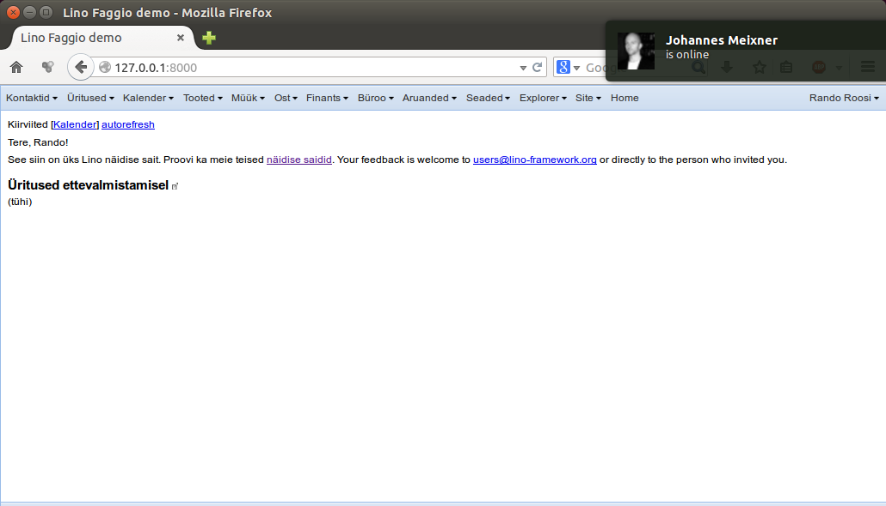

==================
The Lino framework
==================

           
.. image:: ../docs/.build/_static/logo_web3.png
           :align: left

.. rst-class:: centered
   
November 2016

`www.lino-framework.org <http://www.lino-framework.org>`__

- Lino is a framework for writing desktop-like customized database
  applications.

- Lino is based on `Django
  <https://www.djangoproject.com/>`_ and `Sencha ExtJS
  <http://www.sencha.com/products/extjs/>`_

----

----

Successor of TIM
================

- In **1992** Luc started to write TIM, a framework for writing
  applications for SMEs in East Belgium.

- There are still about 20 TIM users.  Most of them use TIM for
  invoicing and accounting.
  
- TIM is written in dBase/Clipper/Xbase++. No mouse.  

- TIM has survived the switch from BEF to EUR, the switch from DOS to
  Windows and Luc's moving from Belgium to Estonia.
  
- The longest-running (known) TIM installation is a local heating
  systems installer in Eupen who upgraded in **2015** after having
  used a version from **1994** for more than **20 years**.
  
- Lino is the successor of **TIM**
  
- Before discovering Python and Django, Luc tried C++, PHP and Java.

----

Existing Lino applications
==========================

Examples of Lino applications are

- `Lino Welfare <http://welfare.lino-framework.org>`__

- `Lino Così <http://cosi.lino-framework.org>`__

- `Lino Voga <http://voga.lino-framework.org>`__
  
- `Lino Noi <http://noi.lino-framework.org>`__

----
  
Lino Welfare
------------

- `Lino Welfare <http://welfare.lino-framework.org>`__

----

Who uses Lino
=============

- Development started in **2009**.

- The first production site started in **January 2011**.  A
  `Lino Welfare`_ for :ref:`cpaseupen`.

- The second real-world Lino application started in Czechia in
  July 2013.

- **February 2015** : The third production site, a second
  welfare_ for :ref:`cpaschatelet`.

- **April 2015** : :ref:`rk` started to use our own ticket management
  with :ref:`noi`.

- **January 2016** : :ref:`eiche` started to use the first :ref:`voga`
  production site.

- **June 2016** : the first :ref:`care` production site went online.

- Currently starting are :ref:`spz`.

----
  
Who is behind Lino?
===================

- A single developer
- Rumma & Ko
- Hamza
- Abakus  
- The Belgian Welfare centres
  
----

 
Rumma & Ko
----------

- Activity started in 2001
- Turnover 20.000 ... 30.000 € / year

----
  
Die Eiche
=========

- http://www.die-eiche.be

----

Business plan
-------------

- R&K would rather multiply than become big

----

Lino is free software
=====================

.. rst-class:: build

- About freedom
- Luc is *not* the owner of Lino
- Copyright is owned by contributors
- Lino belongs to us all
- Lino belongs to us all --> We all must care

----

History
=======

- July 2012 -- IMIO
- April 2013 -- End of IMIO project
- CodeGears (mylino.org)
- October 2015 : Lino Welfare tariff
- February 2016 -- Alexa, Lino Voga  
- July 2016 -- Search for independent hosters
- September 2016 : Abakus, Rauno
- October 2016 -- Vigla Code Camp, Tanel
    

